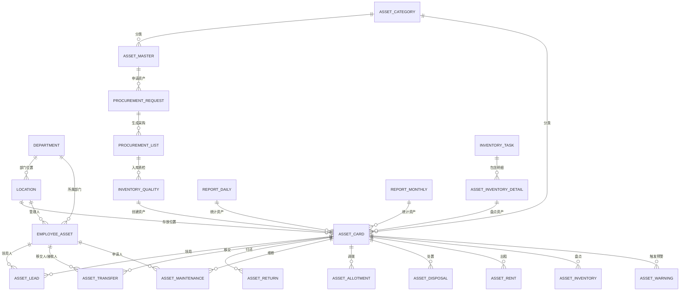

# 医院资产管理系统 - 数据库/数据模型设计文档

## 1. 文档概述

### 1.1 文档目的
本文档详细描述医院资产管理系统的数据库设计，包括 ER 图、核心表结构、数据字典、读写分离方案和索引设计，为开发团队提供统一的数据模型规范。

### 1.2 适用范围
- 数据库设计师
- 后端开发工程师
- 数据分析师

### 1.3 术语定义
| 术语 | 定义 |
|------|------|
| ER | 实体关系图（Entity Relationship） |
| PK | 主键（Primary Key） |
| FK | 外键（Foreign Key） |
| UK | 唯一键（Unique Key） |
| IDX | 索引（Index） |

---

## 2. ER 图

### 2.1 概念 ER 图



### 2.2 物理 ER 图（核心表）

```mermaid
erDiagram
    t_asset_category {
        bigint id PK
        varchar category_code UK
        varchar category_name
        varchar parent_id
        int level
        varchar type
        tinyint status
        datetime create_time
        datetime update_time
    }
    
    t_asset_location {
        bigint id PK
        varchar location_code UK
        varchar location_name
        bigint dept_id FK
        bigint manager_id FK
        varchar address
        varchar building
        varchar floor
        varchar room
        tinyint status
        datetime create_time
        datetime update_time
    }
    
    t_asset_master {
        bigint id PK
        varchar asset_code UK
        varchar asset_name
        bigint category_id FK
        varchar spec_model
        varchar brand
        varchar unit
        decimal default_price
        int warranty_months
        int maintenance_cycle_days
        tinyint status
        datetime create_time
        datetime update_time
    }
    
    t_asset_card {
        bigint id PK
        varchar asset_no UK
        bigint master_id FK
        bigint category_id FK
        bigint location_id FK
        bigint dept_id FK
        bigint user_id FK
        varchar status
        decimal purchase_price
        date purchase_date
        date production_date
        date use_start_date
        date use_end_date
        date warranty_end_date
        date maintenance_next_date
        varchar supplier
        varchar contract_no
        decimal residual_value
        int depreciation_months
        int net_value
        varchar qr_code
        varchar rfid_tag
        varchar image_url
        tinyint is_iot_device
        varchar iot_device_id
        datetime create_time
        datetime update_time
    }
    
    t_procurement_request {
        bigint id PK
        varchar request_no UK
        bigint applicant_id FK
        bigint dept_id FK
        varchar purpose
        varchar status
        datetime apply_date
        datetime audit_date
        bigint auditor_id FK
        varchar audit_remark
        datetime create_time
        datetime update_time
    }
    
    t_procurement_list {
        bigint id PK
        varchar procurement_no UK
        bigint request_id FK
        varchar asset_name
        varchar spec_model
        varchar brand
        int quantity
        decimal estimated_price
        varchar status
        datetime create_time
        datetime update_time
    }
    
    t_inventory_quality {
        bigint id PK
        varchar quality_no UK
        bigint procurement_id FK
        int check_quantity
        int pass_quantity
        int reject_quantity
        varchar quality_result
        varchar remark
        bigint checker_id FK
        datetime check_date
        datetime create_time
    }
    
    t_asset_lead {
        bigint id PK
        varchar lead_no UK
        bigint asset_id FK
        bigint applicant_id FK
        bigint dept_id FK
        varchar purpose
        varchar status
        datetime apply_date
        datetime audit_date
        bigint auditor_id FK
        datetime out_date
        datetime create_time
    }
    
    t_asset_transfer {
        bigint id PK
        varchar transfer_no UK
        bigint asset_id FK
        bigint from_user_id FK
        bigint from_dept_id FK
        bigint to_user_id FK
        bigint to_dept_id FK
        bigint from_location_id FK
        bigint to_location_id FK
        varchar reason
        varchar status
        datetime apply_date
        datetime complete_date
        datetime create_time
    }
    
    t_asset_maintenance {
        bigint id PK
        varchar maintain_no UK
        bigint asset_id FK
        bigint applicant_id FK
        varchar fault_desc
        varchar maintain_type
        bigint maintainer_id FK
        varchar maintain_result
        decimal maintain_cost
        datetime maintain_date
        varchar status
        datetime create_time
    }
    
    t_asset_disposal {
        bigint id PK
        varchar disposal_no UK
        bigint asset_id FK
        varchar disposal_type
        varchar reason
        decimal residual_value
        varchar status
        bigint applicant_id FK
        datetime apply_date
        datetime audit_date
        varchar audit_flow
        datetime complete_date
        datetime create_time
    }
    
    t_inventory_task {
        bigint id PK
        varchar task_no UK
        varchar task_name
        varchar task_type
        datetime plan_start_date
        datetime plan_end_date
        varchar scope_type
        varchar scope_ids
        int total_count
        int completed_count
        int surplus_count
        int loss_count
        varchar status
        bigint creator_id FK
        datetime create_time
    }
    
    t_asset_warning {
        bigint id PK
        varchar warning_no UK
        bigint asset_id FK
        varchar warning_type
        varchar warning_content
        varchar warning_level
        varchar status
        datetime trigger_date
        datetime handle_date
        bigint handler_id FK
        varchar handle_remark
        datetime create_time
    }
```



---

## 3. 核心表结构

### 3.1 基础信息表

#### 3.1.1 资产分类表 (t_asset_category)

| 字段名 | 数据类型 | 长度 | 允许NULL | 默认值 | 说明 | 枚举值 |
|-------|---------|------|---------|--------|------|--------|
| id | BIGINT | - | NO | - | 主键 ID | - |
| category_code | VARCHAR | 50 | NO | - | 分类编码 | - |
| category_name | VARCHAR | 100 | NO | - | 分类名称 | - |
| parent_id | BIGINT | - | YES | NULL | 父分类 ID | - |
| level | INT | - | NO | 1 | 层级 (1-5) | 1,2,3,4,5 |
| type | VARCHAR | 20 | NO | 'fixed' | 分类类型 | fixed(固定资产), intangible(无形资产), consumable(低值易耗品), other(其他) |
| status | TINYINT | - | NO | 1 | 状态 | 0(停用), 1(启用) |
| sort_order | INT | - | NO | 0 | 排序号 | - |
| remark | VARCHAR | 500 | YES | NULL | 备注 | - |
| create_by | BIGINT | - | YES | NULL | 创建人 | - |
| create_time | DATETIME | - | NO | CURRENT_TIMESTAMP | 创建时间 | - |
| update_by | BIGINT | - | YES | NULL | 更新人 | - |
| update_time | DATETIME | - | NO | CURRENT_TIMESTAMP ON UPDATE | 更新时间 | - |

**索引设计**:
```sql
PRIMARY KEY (id);
UNIQUE KEY uk_category_code (category_code);
KEY idx_parent_id (parent_id);
KEY idx_type_status (type, status);
KEY idx_level (level);
```

#### 3.1.2 存放位置表 (t_asset_location)

| 字段名 | 数据类型 | 长度 | 允许NULL | 默认值 | 说明 | 枚举值 |
|-------|---------|------|---------|--------|------|--------|
| id | BIGINT | - | NO | - | 主键 ID | - |
| location_code | VARCHAR | 50 | NO | - | 位置编码 | - |
| location_name | VARCHAR | 100 | NO | - | 位置名称 | - |
| dept_id | BIGINT | - | NO | - | 所属部门 ID | - |
| manager_id | BIGINT | - | YES | NULL | 管理人 ID | - |
| address | VARCHAR | 200 | YES | NULL | 详细地址 | - |
| building | VARCHAR | 50 | YES | NULL | 楼栋 | - |
| floor | VARCHAR | 20 | YES | NULL | 楼层 | - |
| room | VARCHAR | 50 | YES | NULL | 房间号 | - |
| longitude | DECIMAL | 10,6 | YES | NULL | 经度 (IoT 定位) | - |
| latitude | DECIMAL | 10,6 | YES | NULL | 纬度 (IoT 定位) | - |
| status | TINYINT | - | NO | 1 | 状态 | 0(停用), 1(启用) |
| sort_order | INT | - | NO | 0 | 排序号 | - |
| remark | VARCHAR | 500 | YES | NULL | 备注 | - |
| create_by | BIGINT | - | YES | NULL | 创建人 | - |
| create_time | DATETIME | - | NO | CURRENT_TIMESTAMP | 创建时间 | - |
| update_by | BIGINT | - | YES | NULL | 更新人 | - |
| update_time | DATETIME | - | NO | CURRENT_TIMESTAMP ON UPDATE | 更新时间 | - |

**索引设计**:
```sql
PRIMARY KEY (id);
UNIQUE KEY uk_location_code (location_code);
KEY idx_dept_id (dept_id);
KEY idx_manager_id (manager_id);
KEY idx_status (status);
```

#### 3.1.3 资产主数据表 (t_asset_master)

| 字段名 | 数据类型 | 长度 | 允许NULL | 默认值 | 说明 | 枚举值 |
|-------|---------|------|---------|--------|------|--------|
| id | BIGINT | - | NO | - | 主键 ID | - |
| asset_code | VARCHAR | 50 | NO | - | 资产编码 | - |
| asset_name | VARCHAR | 100 | NO | - | 资产名称 | - |
| category_id | BIGINT | - | NO | - | 所属分类 ID | - |
| spec_model | VARCHAR | 100 | YES | NULL | 规格型号 | - |
| brand | VARCHAR | 50 | YES | NULL | 品牌 | - |
| unit | VARCHAR | 20 | NO | '个' | 计量单位 | - |
| default_price | DECIMAL | 12,2 | YES | NULL | 默认单价 | - |
| image_url | VARCHAR | 500 | YES | NULL | 图片 URL | - |
| warranty_months | INT | - | YES | NULL | 保修期 (月) | - |
| maintenance_cycle_days | INT | - | YES | NULL | 保养周期 (天) | - |
| use_life_months | INT | - | YES | NULL | 使用年限 (月) | - |
| depreciation_method | VARCHAR | 20 | YES | 'straight' | 折旧方法 | straight(直线法), declining(加速法) |
| status | TINYINT | - | NO | 1 | 状态 | 0(停用), 1(启用) |
| stock_quantity | INT | - | NO | 0 | 库存数量 | - |
| min_stock | INT | - | YES | NULL | 最低库存预警值 | - |
| max_stock | INT | - | YES | NULL | 最高库存预警值 | - |
| remark | VARCHAR | 500 | YES | NULL | 备注 | - |
| create_by | BIGINT | - | YES | NULL | 创建人 | - |
| create_time | DATETIME | - | NO | CURRENT_TIMESTAMP | 创建时间 | - |
| update_by | BIGINT | - | YES | NULL | 更新人 | - |
| update_time | DATETIME | - | NO | CURRENT_TIMESTAMP ON UPDATE | 更新时间 | - |

**索引设计**:
```sql
PRIMARY KEY (id);
UNIQUE KEY uk_asset_code (asset_code);
KEY idx_category_id (category_id);
KEY idx_status (status);
KEY idx_asset_name (asset_name);
```

### 3.2 资产档案表

#### 3.2.1 资产卡片表 (t_asset_card)

| 字段名 | 数据类型 | 长度 | 允许NULL | 默认值 | 说明 | 枚举值 |
|-------|---------|------|---------|--------|------|--------|
| id | BIGINT | - | NO | - | 主键 ID | - |
| asset_no | VARCHAR | 50 | NO | - | 资产编号 (唯一) | - |
| master_id | BIGINT | - | NO | - | 关联主数据 ID | - |
| category_id | BIGINT | - | NO | - | 分类 ID | - |
| location_id | BIGINT | - | YES | NULL | 存放位置 ID | - |
| dept_id | BIGINT | - | YES | NULL | 使用部门 ID | - |
| user_id | BIGINT | - | YES | NULL | 使用人 ID | - |
| status | VARCHAR | 20 | NO | 'idle' | 资产状态 | idle(闲置), in_use(在用), maintenance(维修中), overhaul(大修中), inventory(盘点中), transfer(移交中), allotment(调拨中), sealed(封存), rented(出租), disposed(已处置) |
| purchase_price | DECIMAL | 12,2 | NO | 0 | 采购价格 | - |
| purchase_date | DATE | - | YES | NULL | 采购日期 | - |
| production_date | DATE | - | YES | NULL | 生产日期 | - |
| use_start_date | DATE | - | YES | NULL | 启用日期 | - |
| use_end_date | DATE | - | YES | NULL | 预计报废日期 | - |
| warranty_end_date | DATE | - | YES | NULL | 保修到期日期 | - |
| maintenance_next_date | DATE | - | YES | NULL | 下次保养日期 | - |
| rent_end_date | DATE | - | YES | NULL | 出租到期日期 | - |
| supplier | VARCHAR | 100 | YES | NULL | 供应商 | - |
| contract_no | VARCHAR | 50 | YES | NULL | 合同编号 | - |
| residual_value | DECIMAL | 12,2 | YES | NULL | 残值 | - |
| depreciation_months | INT | - | YES | NULL | 已折旧月数 | - |
| net_value | DECIMAL | 12,2 | YES | NULL | 净值 | - |
| qr_code | VARCHAR | 100 | YES | NULL | 二维码编码 | - |
| rfid_tag | VARCHAR | 50 | YES | NULL | RFID 标签号 | - |
| image_urls | TEXT | - | YES | NULL | 图片 URLs(JSON 数组) | - |
| attachment_urls | TEXT | - | YES | NULL | 附件 URLs(JSON 数组) | - |
| is_iot_device | TINYINT | - | NO | 0 | 是否 IoT 设备 | 0(否), 1(是) |
| iot_device_id | VARCHAR | 50 | YES | NULL | IoT 设备 ID | - |
| last_position | VARCHAR | 100 | YES | NULL | 最后已知位置 | - |
| last_position_time | DATETIME | - | YES | NULL | 最后位置上报时间 | - |
| check_status | TINYINT | - | NO | 1 | 质检状态 | 0(不合格), 1(合格) |
| remark | VARCHAR | 500 | YES | NULL | 备注 | - |
| create_by | BIGINT | - | YES | NULL | 创建人 | - |
| create_time | DATETIME | - | NO | CURRENT_TIMESTAMP | 创建时间 | - |
| update_by | BIGINT | - | YES | NULL | 更新人 | - |
| update_time | DATETIME | - | NO | CURRENT_TIMESTAMP ON UPDATE | 更新时间 | - |

**索引设计**:
```sql
PRIMARY KEY (id);
UNIQUE KEY uk_asset_no (asset_no);
KEY idx_category_id (category_id);
KEY idx_location_id (location_id);
KEY idx_dept_id (dept_id);
KEY idx_user_id (user_id);
KEY idx_status (status);
KEY idx_purchase_date (purchase_date);
KEY idx_warranty_end_date (warranty_end_date);
KEY idx_maintenance_next_date (maintenance_next_date);
KEY idx_rent_end_date (rent_end_date);
KEY idx_use_end_date (use_end_date);
KEY idx_iot_device_id (iot_device_id);
KEY idx_qr_code (qr_code);
```

### 3.3 资产取得表

#### 3.3.1 采购申请表 (t_procurement_request)

| 字段名 | 数据类型 | 长度 | 允许NULL | 默认值 | 说明 | 枚举值 |
|-------|---------|------|---------|--------|------|--------|
| id | BIGINT | - | NO | - | 主键 ID | - |
| request_no | VARCHAR | 50 | NO | - | 申请单号 | - |
| applicant_id | BIGINT | - | NO | - | 申请人 ID | - |
| dept_id | BIGINT | - | NO | - | 申请部门 ID | - |
| purpose | VARCHAR | 500 | YES | NULL | 申请用途 | - |
| status | VARCHAR | 20 | NO | 'pending' | 状态 | pending(待审核), approved(已通过), rejected(已驳回), partial(部分出库), completed(已完成) |
| apply_date | DATETIME | - | NO | - | 申请日期 | - |
| audit_date | DATETIME | - | YES | NULL | 审核日期 | - |
| auditor_id | BIGINT | - | YES | NULL | 审核人 ID | - |
| audit_remark | VARCHAR | 500 | YES | NULL | 审核意见 | - |
| remark | VARCHAR | 500 | YES | NULL | 备注 | - |
| create_by | BIGINT | - | YES | NULL | 创建人 | - |
| create_time | DATETIME | - | NO | CURRENT_TIMESTAMP | 创建时间 | - |
| update_by | BIGINT | - | YES | NULL | 更新人 | - |
| update_time | DATETIME | - | NO | CURRENT_TIMESTAMP ON UPDATE | 更新时间 | - |

**索引设计**:
```sql
PRIMARY KEY (id);
UNIQUE KEY uk_request_no (request_no);
KEY idx_applicant_id (applicant_id);
KEY idx_dept_id (dept_id);
KEY idx_status (status);
KEY idx_apply_date (apply_date);
```

#### 3.3.2 采购清单表 (t_procurement_list)

| 字段名 | 数据类型 | 长度 | 允许NULL | 默认值 | 说明 | 枚举值 |
|-------|---------|------|---------|--------|------|--------|
| id | BIGINT | - | NO | - | 主键 ID | - |
| procurement_no | VARCHAR | 50 | NO | - | 采购单号 | - |
| request_id | BIGINT | - | YES | NULL | 关联申请 ID | - |
| master_id | BIGINT | - | YES | NULL | 关联主数据 ID | - |
| asset_name | VARCHAR | 100 | NO | - | 资产名称 | - |
| spec_model | VARCHAR | 100 | YES | NULL | 规格型号 | - |
| brand | VARCHAR | 50 | YES | NULL | 品牌 | - |
| quantity | INT | - | NO | 1 | 采购数量 | - |
| received_quantity | INT | - | NO | 0 | 已入库数量 | - |
| estimated_price | DECIMAL | 12,2 | YES | NULL | 预估单价 | - |
| actual_price | DECIMAL | 12,2 | YES | NULL | 实际单价 | - |
| supplier | VARCHAR | 100 | YES | NULL | 供应商 | - |
| status | VARCHAR | 20 | NO | 'pending' | 状态 | pending(待采购), purchasing(采购中), received(待入库), quality_check(质检中), completed(已完成), cancelled(已取消) |
| cancel_reason | VARCHAR | 500 | YES | NULL | 取消原因 | - |
| remark | VARCHAR | 500 | YES | NULL | 备注 | - |
| create_by | BIGINT | - | YES | NULL | 创建人 | - |
| create_time | DATETIME | - | NO | CURRENT_TIMESTAMP | 创建时间 | - |
| update_by | BIGINT | - | YES | NULL | 更新人 | - |
| update_time | DATETIME | - | NO | CURRENT_TIMESTAMP ON UPDATE | 更新时间 | - |

**索引设计**:
```sql
PRIMARY KEY (id);
UNIQUE KEY uk_procurement_no (procurement_no);
KEY idx_request_id (request_id);
KEY idx_master_id (master_id);
KEY idx_status (status);
KEY idx_create_time (create_time);
```

#### 3.3.3 入库质检表 (t_inventory_quality)

| 字段名 | 数据类型 | 长度 | 允许NULL | 默认值 | 说明 | 枚举值 |
|-------|---------|------|---------|--------|------|--------|
| id | BIGINT | - | NO | - | 主键 ID | - |
| quality_no | VARCHAR | 50 | NO | - | 质检单号 | - |
| procurement_id | BIGINT | - | NO | - | 采购清单 ID | - |
| check_quantity | INT | - | NO | 0 | 质检数量 | - |
| pass_quantity | INT | - | NO | 0 | 合格数量 | - |
| reject_quantity | INT | - | NO | 0 | 不合格数量 | - |
| quality_result | VARCHAR | 20 | NO | 'pending' | 质检结果 | pending(待质检), passed(合格), rejected(不合格), partial(部分合格) |
| check_items | TEXT | - | YES | NULL | 质检项 (JSON) | - |
| remark | VARCHAR | 500 | YES | NULL | 备注 | - |
| checker_id | BIGINT | - | YES | NULL | 质检人 ID | - |
| check_date | DATETIME | - | YES | NULL | 质检日期 | - |
| create_by | BIGINT | - | YES | NULL | 创建人 | - |
| create_time | DATETIME | - | NO | CURRENT_TIMESTAMP | 创建时间 | - |
| update_by | BIGINT | - | YES | NULL | 更新人 | - |
| update_time | DATETIME | - | NO | CURRENT_TIMESTAMP ON UPDATE | 更新时间 | - |

**索引设计**:
```sql
PRIMARY KEY (id);
UNIQUE KEY uk_quality_no (quality_no);
KEY idx_procurement_id (procurement_id);
KEY idx_checker_id (checker_id);
KEY idx_check_date (check_date);
```

### 3.4 资产管理表

#### 3.4.1 资产领用表 (t_asset_lead)

| 字段名 | 数据类型 | 长度 | 允许NULL | 默认值 | 说明 | 枚举值 |
|-------|---------|------|---------|--------|------|--------|
| id | BIGINT | - | NO | - | 主键 ID | - |
| lead_no | VARCHAR | 50 | NO | - | 领用单号 | - |
| asset_id | BIGINT | - | NO | - | 资产 ID | - |
| applicant_id | BIGINT | - | NO | - | 申请人 ID | - |
| dept_id | BIGINT | - | NO | - | 申请部门 ID | - |
| purpose | VARCHAR | 500 | YES | NULL | 领用用途 | - |
| expected_return_date | DATE | - | YES | NULL | 预计归还日期 | - |
| status | VARCHAR | 20 | NO | 'pending' | 状态 | pending(待审核), approved(已通过), rejected(已驳回), out(已出库), returned(已归还) |
| apply_date | DATETIME | - | NO | - | 申请日期 | - |
| audit_date | DATETIME | - | YES | NULL | 审核日期 | - |
| auditor_id | BIGINT | - | YES | NULL | 审核人 ID | - |
| out_date | DATETIME | - | YES | NULL | 出库日期 | - |
| return_date | DATETIME | - | YES | NULL | 归还日期 | - |
| remark | VARCHAR | 500 | YES | NULL | 备注 | - |
| create_by | BIGINT | - | YES | NULL | 创建人 | - |
| create_time | DATETIME | - | NO | CURRENT_TIMESTAMP | 创建时间 | - |
| update_by | BIGINT | - | YES | NULL | 更新人 | - |
| update_time | DATETIME | - | NO | CURRENT_TIMESTAMP ON UPDATE | 更新时间 | - |

**索引设计**:
```sql
PRIMARY KEY (id);
UNIQUE KEY uk_lead_no (lead_no);
KEY idx_asset_id (asset_id);
KEY idx_applicant_id (applicant_id);
KEY idx_status (status);
KEY idx_apply_date (apply_date);
```

#### 3.4.2 资产移交表 (t_asset_transfer)

| 字段名 | 数据类型 | 长度 | 允许NULL | 默认值 | 说明 | 枚举值 |
|-------|---------|------|---------|--------|------|--------|
| id | BIGINT | - | NO | - | 主键 ID | - |
| transfer_no | VARCHAR | 50 | NO | - | 移交单号 | - |
| asset_id | BIGINT | - | NO | - | 资产 ID | - |
| from_user_id | BIGINT | - | NO | - | 原使用人 ID | - |
| from_dept_id | BIGINT | - | NO | - | 原部门 ID | - |
| to_user_id | BIGINT | - | NO | - | 新使用人 ID | - |
| to_dept_id | BIGINT | - | NO | - | 新部门 ID | - |
| from_location_id | BIGINT | - | YES | NULL | 原位置 ID | - |
| to_location_id | BIGINT | - | YES | NULL | 新位置 ID | - |
| reason | VARCHAR | 500 | YES | NULL | 移交原因 | - |
| status | VARCHAR | 20 | NO | 'pending' | 状态 | pending(待审核), approved(已通过), rejected(已驳回), completed(已完成) |
| apply_date | DATETIME | - | NO | - | 申请日期 | - |
| audit_date | DATETIME | - | YES | NULL | 审核日期 | - |
| auditor_id | BIGINT | - | YES | NULL | 审核人 ID | - |
| complete_date | DATETIME | - | YES | NULL | 完成日期 | - |
| remark | VARCHAR | 500 | YES | NULL | 备注 | - |
| create_by | BIGINT | - | YES | NULL | 创建人 | - |
| create_time | DATETIME | - | NO | CURRENT_TIMESTAMP | 创建时间 | - |
| update_by | BIGINT | - | YES | NULL | 更新人 | - |
| update_time | DATETIME | - | NO | CURRENT_TIMESTAMP ON UPDATE | 更新时间 | - |

**索引设计**:
```sql
PRIMARY KEY (id);
UNIQUE KEY uk_transfer_no (transfer_no);
KEY idx_asset_id (asset_id);
KEY idx_from_user_id (from_user_id);
KEY idx_to_user_id (to_user_id);
KEY idx_status (status);
```

#### 3.4.3 资产维修表 (t_asset_maintenance)

| 字段名 | 数据类型 | 长度 | 允许NULL | 默认值 | 说明 | 枚举值 |
|-------|---------|------|---------|--------|------|--------|
| id | BIGINT | - | NO | - | 主键 ID | - |
| maintain_no | VARCHAR | 50 | NO | - | 维修单号 | - |
| asset_id | BIGINT | - | NO | - | 资产 ID | - |
| applicant_id | BIGINT | - | NO | - | 申请人 ID | - |
| fault_desc | TEXT | - | NO | - | 故障描述 | - |
| fault_image_urls | TEXT | - | YES | NULL | 故障图片 (JSON) | - |
| maintain_type | VARCHAR | 20 | NO | 'repair' | 维修类型 | repair(维修), maintenance(保养), overhaul(大修) |
| priority | VARCHAR | 20 | NO | 'normal' | 优先级 | low(低), normal(正常), high(高), urgent(紧急) |
| maintainer_id | BIGINT | - | YES | NULL | 维修人 ID | - |
| maintain_result | TEXT | - | YES | NULL | 维修结果 | - |
| maintain_cost | DECIMAL | 12,2 | YES | NULL | 维修费用 | - |
| maintain_parts | TEXT | - | YES | NULL | 更换配件 (JSON) | - |
| status | VARCHAR | 20 | NO | 'pending' | 状态 | pending(待受理), processing(维修中), waiting_accept(待验收), completed(已完成), rejected(已驳回) |
| apply_date | DATETIME | - | NO | - | 申请日期 | - |
| accept_date | DATETIME | - | YES | NULL | 受理日期 | - |
| maintain_date | DATETIME | - | YES | NULL | 维修日期 | - |
| complete_date | DATETIME | - | YES | NULL | 完成日期 | - |
| remark | VARCHAR | 500 | YES | NULL | 备注 | - |
| create_by | BIGINT | - | YES | NULL | 创建人 | - |
| create_time | DATETIME | - | NO | CURRENT_TIMESTAMP | 创建时间 | - |
| update_by | BIGINT | - | YES | NULL | 更新人 | - |
| update_time | DATETIME | - | NO | CURRENT_TIMESTAMP ON UPDATE | 更新时间 | - |

**索引设计**:
```sql
PRIMARY KEY (id);
UNIQUE KEY uk_maintain_no (maintain_no);
KEY idx_asset_id (asset_id);
KEY idx_applicant_id (applicant_id);
KEY idx_maintainer_id (maintainer_id);
KEY idx_status (status);
KEY idx_maintain_type (maintain_type);
KEY idx_apply_date (apply_date);
```

#### 3.4.4 资产处置表 (t_asset_disposal)

| 字段名 | 数据类型 | 长度 | 允许NULL | 默认值 | 说明 | 枚举值 |
|-------|---------|------|---------|--------|------|--------|
| id | BIGINT | - | NO | - | 主键 ID | - |
| disposal_no | VARCHAR | 50 | NO | - | 处置单号 | - |
| asset_id | BIGINT | - | NO | - | 资产 ID | - |
| disposal_type | VARCHAR | 20 | NO | - | 处置类型 | scrap(报废), loss(报损), exchange(置换), donate(捐赠), sell(出售) |
| reason | TEXT | - | NO | - | 处置原因 | - |
| original_value | DECIMAL | 12,2 | YES | NULL | 原值 | - |
| residual_value | DECIMAL | 12,2 | YES | NULL | 残值/变卖收入 | - |
| disposal_cost | DECIMAL | 12,2 | YES | NULL | 处置费用 | - |
| status | VARCHAR | 20 | NO | 'pending' | 状态 | pending(待审批), auditing(审批中), approved(已批准), rejected(已驳回), processing(处置中), completed(已完成) |
| applicant_id | BIGINT | - | NO | - | 申请人 ID | - |
| apply_date | DATETIME | - | NO | - | 申请日期 | - |
| audit_flow | TEXT | - | YES | NULL | 审批流程 (JSON) | - |
| audit_date | DATETIME | - | YES | NULL | 审批完成日期 | - |
| complete_date | DATETIME | - | YES | NULL | 处置完成日期 | - |
| remark | VARCHAR | 500 | YES | NULL | 备注 | - |
| create_by | BIGINT | - | YES | NULL | 创建人 | - |
| create_time | DATETIME | - | NO | CURRENT_TIMESTAMP | 创建时间 | - |
| update_by | BIGINT | - | YES | NULL | 更新人 | - |
| update_time | DATETIME | - | NO | CURRENT_TIMESTAMP ON UPDATE | 更新时间 | - |

**索引设计**:
```sql
PRIMARY KEY (id);
UNIQUE KEY uk_disposal_no (disposal_no);
KEY idx_asset_id (asset_id);
KEY idx_disposal_type (disposal_type);
KEY idx_status (status);
KEY idx_apply_date (apply_date);
```

### 3.5 资产盘点表

#### 3.5.1 盘点任务表 (t_inventory_task)

| 字段名 | 数据类型 | 长度 | 允许NULL | 默认值 | 说明 | 枚举值 |
|-------|---------|------|---------|--------|------|--------|
| id | BIGINT | - | NO | - | 主键 ID | - |
| task_no | VARCHAR | 50 | NO | - | 任务单号 | - |
| task_name | VARCHAR | 100 | NO | - | 任务名称 | - |
| task_type | VARCHAR | 20 | NO | 'manual' | 盘点类型 | manual(人工盘点), scan(扫码盘点), iot(IoT 自动盘点) |
| plan_start_date | DATETIME | - | NO | - | 计划开始时间 | - |
| plan_end_date | DATETIME | - | NO | - | 计划结束时间 | - |
| actual_start_date | DATETIME | - | YES | NULL | 实际开始时间 | - |
| actual_end_date | DATETIME | - | YES | NULL | 实际结束时间 | - |
| scope_type | VARCHAR | 20 | NO | 'all' | 盘点范围类型 | all(全部), category(按分类), dept(按部门), location(按位置), status(按状态) |
| scope_ids | TEXT | - | YES | NULL | 范围 IDs(JSON 数组) | - |
| total_count | INT | - | NO | 0 | 应盘总数 | - |
| completed_count | INT | - | NO | 0 | 已盘数量 | - |
| normal_count | INT | - | NO | 0 | 正常数量 | - |
| surplus_count | INT | - | NO | 0 | 盘盈数量 | - |
| loss_count | INT | - | NO | 0 | 盘亏数量 | - |
| status | VARCHAR | 20 | NO | 'pending' | 状态 | pending(待执行), executing(执行中), partial(部分完成), completed(已完成), cancelled(已取消) |
| creator_id | BIGINT | - | NO | - | 创建人 ID | - |
| remark | VARCHAR | 500 | YES | NULL | 备注 | - |
| create_by | BIGINT | - | YES | NULL | 创建人 | - |
| create_time | DATETIME | - | NO | CURRENT_TIMESTAMP | 创建时间 | - |
| update_by | BIGINT | - | YES | NULL | 更新人 | - |
| update_time | DATETIME | - | NO | CURRENT_TIMESTAMP ON UPDATE | 更新时间 | - |

**索引设计**:
```sql
PRIMARY KEY (id);
UNIQUE KEY uk_task_no (task_no);
KEY idx_task_type (task_type);
KEY idx_status (status);
KEY idx_plan_start_date (plan_start_date);
KEY idx_creator_id (creator_id);
```

#### 3.5.2 盘点明细表 (t_inventory_detail)

| 字段名 | 数据类型 | 长度 | 允许NULL | 默认值 | 说明 | 枚举值 |
|-------|---------|------|---------|--------|------|--------|
| id | BIGINT | - | NO | - | 主键 ID | - |
| task_id | BIGINT | - | NO | - | 任务 ID | - |
| asset_id | BIGINT | - | NO | - | 资产 ID | - |
| asset_no | VARCHAR | 50 | NO | - | 资产编号 | - |
| check_result | VARCHAR | 20 | NO | 'normal' | 盘点结果 | normal(正常), surplus(盘盈), loss(盘亏) |
| check_position | VARCHAR | 100 | YES | NULL | 盘点时位置 | - |
| system_position | VARCHAR | 100 | YES | NULL | 系统记录位置 | - |
| difference_desc | VARCHAR | 500 | YES | NULL | 差异说明 | - |
| checker_id | BIGINT | - | YES | NULL | 盘点人 ID | - |
| check_time | DATETIME | - | YES | NULL | 盘点时间 | - |
| check_method | VARCHAR | 20 | NO | 'manual' | 盘点方式 | manual(人工), scan(扫码), iot(IoT) |
| photo_urls | TEXT | - | YES | NULL | 现场照片 (JSON) | - |
| remark | VARCHAR | 500 | YES | NULL | 备注 | - |
| create_time | DATETIME | - | NO | CURRENT_TIMESTAMP | 创建时间 | - |
| update_time | DATETIME | - | NO | CURRENT_TIMESTAMP ON UPDATE | 更新时间 | - |

**索引设计**:
```sql
PRIMARY KEY (id);
KEY idx_task_id (task_id);
KEY idx_asset_id (asset_id);
KEY idx_check_result (check_result);
KEY idx_checker_id (checker_id);
KEY idx_check_time (check_time);
UNIQUE KEY uk_task_asset (task_id, asset_id);
```

### 3.6 预警表

#### 3.6.1 资产预警表 (t_asset_warning)

| 字段名 | 数据类型 | 长度 | 允许NULL | 默认值 | 说明 | 枚举值 |
|-------|---------|------|---------|--------|------|--------|
| id | BIGINT | - | NO | - | 主键 ID | - |
| warning_no | VARCHAR | 50 | NO | - | 预警单号 | - |
| asset_id | BIGINT | - | NO | - | 资产 ID | - |
| warning_type | VARCHAR | 20 | NO | - | 预警类型 | warranty(保修到期), maintenance(保养到期), rent(租出到期), use_end(使用到期), scrap(报废预警), stock(库存预警), position(位置异常) |
| warning_level | VARCHAR | 20 | NO | 'normal' | 预警级别 | low(低), normal(正常), high(高), urgent(紧急) |
| warning_content | VARCHAR | 500 | NO | - | 预警内容 | - |
| trigger_condition | VARCHAR | 200 | YES | NULL | 触发条件 | - |
| days_remaining | INT | - | YES | NULL | 剩余天数 | - |
| status | VARCHAR | 20 | NO | 'unhandled' | 状态 | unhandled(未处理), processing(处理中), handled(已处理), ignored(已忽略) |
| trigger_date | DATETIME | - | NO | - | 触发时间 | - |
| handle_date | DATETIME | - | YES | NULL | 处理时间 | - |
| handler_id | BIGINT | - | YES | NULL | 处理人 ID | - |
| handle_remark | VARCHAR | 500 | YES | NULL | 处理说明 | - |
| notify_sent | TINYINT | - | NO | 0 | 是否已通知 | 0(否), 1(是) |
| create_time | DATETIME | - | NO | CURRENT_TIMESTAMP | 创建时间 | - |
| update_time | DATETIME | - | NO | CURRENT_TIMESTAMP ON UPDATE | 更新时间 | - |

**索引设计**:
```sql
PRIMARY KEY (id);
UNIQUE KEY uk_warning_no (warning_no);
KEY idx_asset_id (asset_id);
KEY idx_warning_type (warning_type);
KEY idx_warning_level (warning_level);
KEY idx_status (status);
KEY idx_trigger_date (trigger_date);
KEY idx_handler_id (handler_id);
```

### 3.7 系统表

#### 3.7.1 用户表 (t_sys_user)

| 字段名 | 数据类型 | 长度 | 允许NULL | 默认值 | 说明 | 枚举值 |
|-------|---------|------|---------|--------|------|--------|
| id | BIGINT | - | NO | - | 主键 ID | - |
| username | VARCHAR | 50 | NO | - | 用户名 | - |
| password | VARCHAR | 100 | NO | - | 密码 (加密) | - |
| real_name | VARCHAR | 50 | NO | - | 真实姓名 | - |
| phone | VARCHAR | 20 | YES | NULL | 手机号 | - |
| email | VARCHAR | 100 | YES | NULL | 邮箱 | - |
| dept_id | BIGINT | - | YES | NULL | 部门 ID | - |
| position | VARCHAR | 50 | YES | NULL | 职位 | - |
| status | TINYINT | - | NO | 1 | 状态 | 0(禁用), 1(启用) |
| last_login_time | DATETIME | - | YES | NULL | 最后登录时间 | - |
| last_login_ip | VARCHAR | 50 | YES | NULL | 最后登录 IP | - |
| create_time | DATETIME | - | NO | CURRENT_TIMESTAMP | 创建时间 | - |
| update_time | DATETIME | - | NO | CURRENT_TIMESTAMP ON UPDATE | 更新时间 | - |

**索引设计**:
```sql
PRIMARY KEY (id);
UNIQUE KEY uk_username (username);
KEY idx_dept_id (dept_id);
KEY idx_status (status);
```

#### 3.7.2 操作日志表 (t_operation_log)

| 字段名 | 数据类型 | 长度 | 允许NULL | 默认值 | 说明 |
|-------|---------|------|---------|--------|------|
| id | BIGINT | - | NO | - | 主键 ID |
| module | VARCHAR | 50 | YES | NULL | 模块 |
| operation | VARCHAR | 50 | YES | NULL | 操作类型 |
| method | VARCHAR | 200 | YES | NULL | 请求方法 |
| url | VARCHAR | 500 | YES | NULL | 请求 URL |
| params | TEXT | - | YES | NULL | 请求参数 (JSON) |
| result | TEXT | - | YES | NULL | 返回结果 (JSON) |
| operator_id | BIGINT | - | YES | NULL | 操作人 ID |
| operator_name | VARCHAR | 50 | YES | NULL | 操作人姓名 |
| ip | VARCHAR | 50 | YES | NULL | 操作 IP |
| location | VARCHAR | 100 | YES | NULL | 操作地点 |
| cost_time | BIGINT | - | YES | NULL | 耗时 (ms) |
| status | TINYINT | - | NO | 1 | 状态 0(失败), 1(成功) |
| error_msg | VARCHAR | 2000 | YES | NULL | 错误信息 |
| create_time | DATETIME | - | NO | CURRENT_TIMESTAMP | 创建时间 |

**索引设计**:
```sql
PRIMARY KEY (id);
KEY idx_operator_id (operator_id);
KEY idx_module (module);
KEY idx_operation (operation);
KEY idx_create_time (create_time);
```

---

## 4. 数据字典

### 4.1 资产状态字典

| 编码 | 名称 | 说明 |
|------|------|------|
| idle | 闲置 | 资产在库，未被使用 |
| in_use | 在用 | 资产正在使用中 |
| maintenance | 维修中 | 资产正在维修 |
| overhaul | 大修中 | 资产正在大修 |
| inventory | 盘点中 | 资产正在盘点 |
| transfer | 移交中 | 资产正在移交 |
| allotment | 调拨中 | 资产正在调拨 |
| sealed | 封存 | 资产被封存 |
| rented | 出租 | 资产出租中 |
| disposed | 已处置 | 资产已处置 |

### 4.2 采购状态字典

| 编码 | 名称 | 说明 |
|------|------|------|
| pending | 待采购 | 等待采购执行 |
| purchasing | 采购中 | 正在采购 |
| received | 待入库 | 采购完成，待入库 |
| quality_check | 质检中 | 正在质检 |
| completed | 已完成 | 采购完成 |
| cancelled | 已取消 | 采购取消 |

### 4.3 预警类型字典

| 编码 | 名称 | 触发条件 |
|------|------|----------|
| warranty | 保修到期 | 保修期剩余≤30 天 |
| maintenance | 保养到期 | 保养计划日期剩余≤30 天 |
| rent | 租出到期 | 出租到期剩余≤30 天 |
| use_end | 使用到期 | 使用期限剩余≤30 天 |
| scrap | 报废预警 | 达到报废年限 |
| stock | 库存预警 | 库存低于最低值或高于最高值 |
| position | 位置异常 | IoT 设备位置异常 |

### 4.4 处置类型字典

| 编码 | 名称 | 说明 |
|------|------|------|
| scrap | 报废 | 资产达到使用年限或无法修复 |
| loss | 报损 | 资产丢失或损坏 |
| exchange | 置换 | 以旧换新 |
| donate | 捐赠 | 对外捐赠 |
| sell | 出售 | 变卖资产 |

---

## 5. 读写分离方案

### 5.1 架构设计

```
┌─────────────┐
│   应用层     │
│  (ShardingJDBC)│
└──────┬──────┘
       │
       ├──────────────┐
       │              │
┌──────▼──────┐ ┌─────▼──────┐
│  写数据源    │ │  读数据源   │
│  (Master)   │ │  (Slave)   │
│  MySQL 主库  │ │  MySQL 从库 │
└─────────────┘ └────────────┘
```

### 5.2 读写分离配置

```yaml
spring:
  shardingsphere:
    datasource:
      names: ds-master,ds-slave0,ds-slave1
      ds-master:
        jdbc-url: jdbc:mysql://mysql-master:3306/hospital_ams
        username: ${DB_USERNAME}
        password: ${DB_PASSWORD}
      ds-slave0:
        jdbc-url: jdbc:mysql://mysql-slave0:3306/hospital_ams
        username: ${DB_USERNAME}
        password: ${DB_PASSWORD}
      ds-slave1:
        jdbc-url: jdbc:mysql://mysql-slave1:3306/hospital_ams
        username: ${DB_USERNAME}
        password: ${DB_PASSWORD}
    
    rules:
      readwrite-splitting:
        data-groups:
          pr_ds:
            write-data-source-name: ds-master
            read-data-source-names: ds-slave0,ds-slave1
            load-balancer-name: random
        load-balancers:
          random:
            type: RANDOM
```

### 5.3 读写分离策略

| 操作类型 | 数据源 | 说明 |
|---------|--------|------|
| INSERT/UPDATE/DELETE | 主库 | 所有写操作路由到主库 |
| SELECT | 从库 | 查询操作路由到从库 |
| 事务内查询 | 主库 | 保证数据一致性 |
| 实时性要求高的查询 | 主库 | 如库存检查 |
| 报表统计查询 | 从库 | 减轻主库压力 |

### 5.4 主从延迟处理

1. **强制读主库**: 关键业务使用 `@HintManager` 强制读主库
2. **延迟监控**: 监控主从延迟，超过阈值告警
3. **补偿机制**: 发现数据不一致时自动重试读主库

---

## 6. 索引设计

### 6.1 索引设计原则

1. **主键索引**: 每张表必须有主键，推荐使用 BIGINT 自增或雪花算法 ID
2. **唯一索引**: 业务唯一字段建立唯一索引（如编码类字段）
3. **外键索引**: 所有外键字段必须建立索引
4. **查询索引**: WHERE、ORDER BY、GROUP BY 涉及的字段考虑建立索引
5. **复合索引**: 遵循最左前缀原则，区分度高的字段在前
6. **覆盖索引**: 尽量使用覆盖索引减少回表

### 6.2 核心表索引汇总

| 表名 | 索引名 | 字段 | 类型 | 说明 |
|------|--------|------|------|------|
| t_asset_category | PRIMARY | id | 主键 | - |
| | uk_category_code | category_code | 唯一 | 分类编码唯一 |
| | idx_parent_id | parent_id | 普通 | 父子查询 |
| | idx_type_status | type,status | 复合 | 分类筛选 |
| t_asset_location | PRIMARY | id | 主键 | - |
| | uk_location_code | location_code | 唯一 | 位置编码唯一 |
| | idx_dept_id | dept_id | 普通 | 部门查询 |
| | idx_manager_id | manager_id | 普通 | 管理人查询 |
| t_asset_master | PRIMARY | id | 主键 | - |
| | uk_asset_code | asset_code | 唯一 | 资产编码唯一 |
| | idx_category_id | category_id | 普通 | 分类查询 |
| t_asset_card | PRIMARY | id | 主键 | - |
| | uk_asset_no | asset_no | 唯一 | 资产编号唯一 |
| | idx_category_id | category_id | 普通 | 分类查询 |
| | idx_location_id | location_id | 普通 | 位置查询 |
| | idx_dept_id | dept_id | 普通 | 部门查询 |
| | idx_user_id | user_id | 普通 | 使用人查询 |
| | idx_status | status | 普通 | 状态筛选 |
| | idx_warranty_end_date | warranty_end_date | 普通 | 保修预警 |
| | idx_maintenance_next_date | maintenance_next_date | 普通 | 保养预警 |
| | idx_rent_end_date | rent_end_date | 普通 | 出租预警 |
| | idx_use_end_date | use_end_date | 普通 | 使用到期预警 |
| t_procurement_list | PRIMARY | id | 主键 | - |
| | uk_procurement_no | procurement_no | 唯一 | 采购单号唯一 |
| | idx_status | status | 普通 | 状态筛选 |
| | idx_create_time | create_time | 普通 | 时间排序 |
| t_asset_maintenance | PRIMARY | id | 主键 | - |
| | uk_maintain_no | maintain_no | 唯一 | 维修单号唯一 |
| | idx_asset_id | asset_id | 普通 | 资产查询 |
| | idx_status | status | 普通 | 状态筛选 |
| | idx_apply_date | apply_date | 普通 | 时间排序 |
| t_inventory_task | PRIMARY | id | 主键 | - |
| | uk_task_no | task_no | 唯一 | 任务单号唯一 |
| | idx_status | status | 普通 | 状态筛选 |
| | idx_plan_start_date | plan_start_date | 普通 | 时间排序 |
| t_inventory_detail | PRIMARY | id | 主键 | - |
| | uk_task_asset | task_id,asset_id | 唯一 | 任务资产唯一 |
| | idx_check_result | check_result | 普通 | 结果筛选 |
| t_asset_warning | PRIMARY | id | 主键 | - |
| | uk_warning_no | warning_no | 唯一 | 预警单号唯一 |
| | idx_warning_type | warning_type | 普通 | 类型筛选 |
| | idx_status | status | 普通 | 状态筛选 |
| | idx_trigger_date | trigger_date | 普通 | 时间排序 |

### 6.3 慢查询优化

1. **EXPLAIN 分析**: 定期分析慢查询日志，优化索引
2. **避免全表扫描**: 确保查询走索引
3. **避免索引失效**: 
   - 不在索引列上做函数运算
   - 避免隐式类型转换
   - LIKE 查询不以%开头
4. **分页优化**: 大表分页使用覆盖索引+子查询
5. **批量操作**: 大批量插入使用批量语句

---

## 7. 数据归档策略

### 7.1 归档范围

| 数据类型 | 归档条件 | 归档周期 |
|---------|---------|---------|
| 操作日志 | 超过 1 年 | 每月 |
| 已处置资产 | 处置完成超过 3 年 | 每年 |
| 历史盘点任务 | 完成超过 2 年 | 每年 |
| 已完成维修单 | 完成超过 2 年 | 每年 |

### 7.2 归档方式

1. **历史表归档**: 将历史数据迁移到 `_history` 后缀的表
2. **冷存储**: 归档数据存入低成本存储
3. **分区表**: 大表按月/年分区

---

## 8. 附录

### 8.1 SQL 初始化脚本

```sql
-- 创建数据库
CREATE DATABASE IF NOT EXISTS hospital_ams DEFAULT CHARACTER SET utf8mb4 COLLATE utf8mb4_unicode_ci;

-- 使用数据库
USE hospital_ams;
```

### 8.2 参考文档
- 《医院资产管理系统需求规格说明书》
- 《系统架构设计文档》
- 《非功能需求说明》

### 8.3 修订历史

| 版本 | 日期 | 作者 | 说明 |
|------|------|------|------|
| v1.0 | 2024-01-XX | 数据架构组 | 初稿 |
