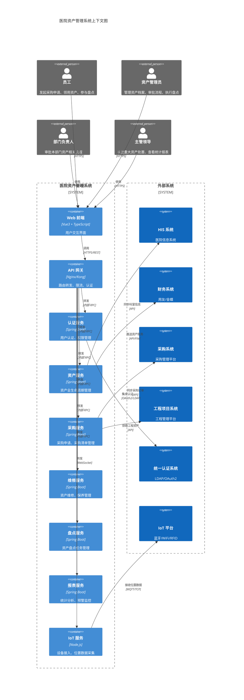
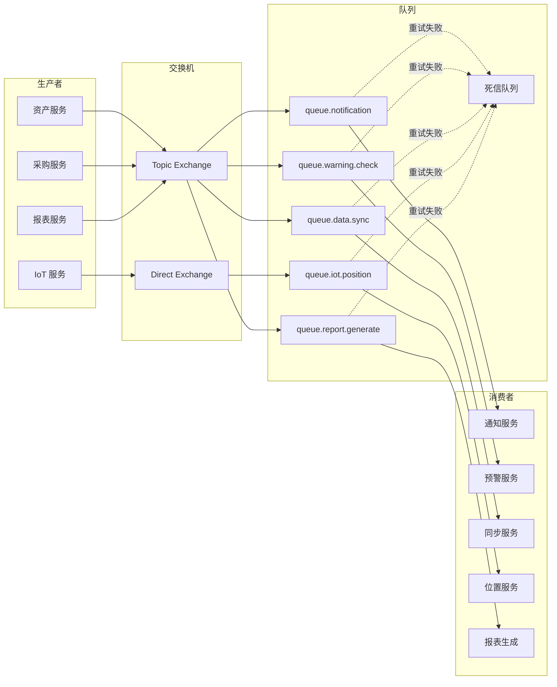

# 医院资产管理系统 - 系统架构设计文档

## 1. 文档概述

### 1.1 文档目的
本文档旨在描述医院资产管理系统的整体架构设计，包括系统上下文、模块划分、技术栈选型、部署架构以及缓存/消息队列策略，为开发团队提供统一的技术指导。

### 1.2 适用范围
- 系统架构师
- 后端开发工程师
- 前端开发工程师
- 运维工程师
- 测试工程师

### 1.3 术语定义
| 术语 | 定义 |
|------|------|
| RBAC | 基于角色的访问控制（Role-Based Access Control） |
| IoT | 物联网（Internet of Things） |
| WAF | Web 应用防火墙（Web Application Firewall） |
| RTO | 恢复时间目标（Recovery Time Objective） |
| RPO | 恢复点目标（Recovery Point Objective） |

---

## 2. 系统上下文图



---

## 3. 模块划分

### 3.1 系统分层架构

```
┌─────────────────────────────────────────────────────────────┐
│                      展现层 (Presentation Layer)              │
│  ┌─────────────┐  ┌─────────────┐  ┌─────────────┐          │
│  │  PC 管理端   │  │  移动端 H5   │  │  标签打印端  │          │
│  │  Vue3+TS    │  │  响应式布局  │  │  打印组件   │          │
│  └─────────────┘  └─────────────┘  └─────────────┘          │
└─────────────────────────────────────────────────────────────┘
                              ↓ HTTPS
┌─────────────────────────────────────────────────────────────┐
│                      网关层 (Gateway Layer)                   │
│  ┌─────────────────────────────────────────────────────┐    │
│  │  Nginx/Kong: 路由转发、负载均衡、限流熔断、SSL 终止     │    │
│  └─────────────────────────────────────────────────────┘    │
└─────────────────────────────────────────────────────────────┘
                              ↓ RPC/HTTP
┌─────────────────────────────────────────────────────────────┐
│                      应用层 (Application Layer)               │
│  ┌──────────┐ ┌──────────┐ ┌──────────┐ ┌──────────┐       │
│  │ 认证服务  │ │ 资产服务  │ │ 采购服务  │ │ 维修服务  │       │
│  └──────────┘ └──────────┘ └──────────┘ └──────────┘       │
│  ┌──────────┐ ┌──────────┐ ┌──────────┐ ┌──────────┐       │
│  │ 盘点服务  │ │ 报表服务  │ │ IoT 服务   │ │ 通知服务  │       │
│  └──────────┘ └──────────┘ └──────────┘ └──────────┘       │
└─────────────────────────────────────────────────────────────┘
                              ↓
┌─────────────────────────────────────────────────────────────┐
│                      服务层 (Service Layer)                   │
│  ┌─────────────────────────────────────────────────────┐    │
│  │  业务逻辑处理、事务管理、规则引擎、工作流引擎           │    │
│  └─────────────────────────────────────────────────────┘    │
└─────────────────────────────────────────────────────────────┘
                              ↓
┌─────────────────────────────────────────────────────────────┐
│                      数据层 (Data Layer)                      │
│  ┌──────────┐ ┌──────────┐ ┌──────────┐ ┌──────────┐       │
│  │  MySQL   │ │  Redis   │ │ InfluxDB │ │   OSS    │       │
│  │  主数据库 │ │  缓存    │ │  时序库   │ │  文件存储 │       │
│  └──────────┘ └──────────┘ └──────────┘ └──────────┘       │
└─────────────────────────────────────────────────────────────┘
```

### 3.2 核心服务模块

#### 3.2.1 认证服务 (auth-service)
**职责**: 用户身份认证、权限管理、会话管理

**核心功能**:
- 用户登录/登出
- JWT Token 生成与验证
- RBAC 权限控制
- 数据权限隔离
- 操作日志记录
- 单点登录集成

**接口协议**: RESTful API

#### 3.2.2 资产服务 (asset-service)
**职责**: 资产全生命周期管理

**核心功能**:
- 资产分类管理
- 存放位置管理
- 资产主数据管理
- 资产卡片管理（按类型、状态）
- 资产领用/移交/归还
- 资产调拨
- 资产维修/保养
- 资产处置
- 出租管理
- 预警监控

**接口协议**: RESTful API

#### 3.2.3 采购服务 (procurement-service)
**职责**: 资产取得流程管理

**核心功能**:
- 采购申请管理
- 库存匹配检查
- 待采购清单管理
- 入库质检管理
- 采购系统集成

**接口协议**: RESTful API

#### 3.2.4 维修服务 (maintenance-service)
**职责**: 资产维修保养管理

**核心功能**:
- 维修单管理
- 保养计划管理
- 保养记录管理
- 维修验收管理

**接口协议**: RESTful API

#### 3.2.5 盘点服务 (inventory-service)
**职责**: 资产盘点任务管理

**核心功能**:
- 盘点计划制定
- 盘点任务分配
- 扫码盘点支持
- 盘盈盘亏处理
- 盘点报告生成
- 自动盘点（IoT）

**接口协议**: RESTful API + WebSocket

#### 3.2.6 报表服务 (report-service)
**职责**: 统计分析、预警监控

**核心功能**:
- 资产管理概况报表
- 出入库情况报表
- 过程监控报表
- 运营情况报表
- 资产预警（报废、维修、库存）
- 数据可视化

**接口协议**: RESTful API

#### 3.2.7 IoT 服务 (iot-service)
**职责**: 物联网设备接入与位置管理

**核心功能**:
- 设备注册管理
- 位置数据接收（MQTT/TCP）
- 实时位置追踪
- 位置数据存储
- 设备找寻
- 自动盘点支持

**接口协议**: MQTT + WebSocket + RESTful API

#### 3.2.8 通知服务 (notification-service)
**职责**: 消息通知管理

**核心功能**:
- 站内消息
- 短信通知
- 邮件通知
- 钉钉/企业微信通知
- 消息模板管理

**接口协议**: RESTful API + Message Queue

---

## 4. 技术栈选型

### 4.1 前端技术栈

| 技术 | 选型 | 说明 |
|------|------|------|
| 框架 | Vue 3.3+ | 渐进式 JavaScript 框架 |
| 语言 | TypeScript 5.0+ | 类型安全的 JavaScript 超集 |
| 构建工具 | Vite 4.x | 下一代前端构建工具 |
| 状态管理 | Pinia | Vue 官方推荐状态管理库 |
| 路由 | Vue Router 4.x | 官方路由管理器 |
| UI 组件库 | Element Plus | 基于 Vue 3 的组件库 |
| HTTP 客户端 | Axios | Promise 基础 HTTP 客户端 |
| 图表库 | ECharts 5.x | 可视化图表库 |
| 扫码库 | html5-qrcode | 浏览器二维码扫描 |
| 打印 | print-js | 浏览器打印支持 |
| 代码规范 | ESLint + Prettier | 代码质量工具 |

### 4.2 后端技术栈

| 技术 | 选型 | 说明 |
|------|------|------|
| 框架 | Spring Boot 3.x | Java 微服务框架 |
| 语言 | Java 17+ | LTS 版本 |
| ORM | MyBatis Plus | 持久层框架 |
| 数据库连接池 | HikariCP | 高性能 JDBC 连接池 |
| 权限框架 | Spring Security + JWT | 安全认证框架 |
| 工作流引擎 | Flowable | 业务流程管理 |
| 规则引擎 | Drools | 业务规则引擎 |
| API 文档 | SpringDoc OpenAPI | API 文档生成 |
| 日志框架 | Logback + SLF4J | 日志管理 |
| 工具库 | Hutool、Guava | 通用工具类库 |

### 4.3 数据存储

| 技术 | 选型 | 说明 |
|------|------|------|
| 关系数据库 | MySQL 8.0 | 主数据库，存储业务数据 |
| 缓存数据库 | Redis 7.0 | 缓存、会话存储、分布式锁 |
| 时序数据库 | InfluxDB 2.0 | IoT 位置数据存储 |
| 搜索引擎 | Elasticsearch 8.x | 全文检索、日志分析 |
| 对象存储 | MinIO / 阿里云 OSS | 文件、图片存储 |

### 4.4 中间件

| 技术 | 选型 | 说明 |
|------|------|------|
| 消息队列 | RabbitMQ / RocketMQ | 异步通信、事件驱动 |
| API 网关 | Nginx + Kong | 路由转发、限流、认证 |
| 配置中心 | Nacos | 配置管理、服务发现 |
| 任务调度 | XXL-JOB | 分布式任务调度 |

### 4.5 运维监控

| 技术 | 选型 | 说明 |
|------|------|------|
| 容器化 | Docker + Kubernetes | 容器编排 |
| CI/CD | Jenkins / GitLab CI | 持续集成/部署 |
| 监控 | Prometheus + Grafana | 系统监控、告警 |
| 链路追踪 | SkyWalking | 分布式链路追踪 |
| 日志收集 | ELK Stack | 日志集中管理 |

---

## 5. 部署架构

### 5.1 生产环境部署架构

```mermaid
flowchart TB
    subgraph CDN["CDN 加速层"]
        cdn[CDN 节点]
    end

    subgraph LB["负载均衡层"]
        slb[SLB/Nginx]
    end

    subgraph Gateway["网关层"]
        kong1[Kong 节点 1]
        kong2[Kong 节点 2]
        kong3[Kong 节点 3]
    end

    subgraph App["应用服务层"]
        subgraph Auth["认证服务集群"]
            auth1[auth-service-1]
            auth2[auth-service-2]
        end
        
        subgraph Asset["资产服务集群"]
            asset1[asset-service-1]
            asset2[asset-service-2]
            asset3[asset-service-3]
        end
        
        subgraph Procurement["采购服务集群"]
            proc1[procurement-service-1]
            proc2[procurement-service-2]
        end
        
        subgraph Maintenance["维修服务集群"]
            maint1[maintenance-service-1]
            maint2[maintenance-service-2]
        end
        
        subgraph Inventory["盘点服务集群"]
            inv1[inventory-service-1]
            inv2[inventory-service-2]
        end
        
        subgraph Report["报表服务集群"]
            report1[report-service-1]
            report2[report-service-2]
        end
        
        subgraph IoT["IoT 服务集群"]
            iot1[iot-service-1]
            iot2[iot-service-2]
            iot3[iot-service-3]
        end
    end

    subgraph Data["数据存储层"]
        subgraph MySQL["MySQL 主从集群"]
            mysqlM[MySQL Master]
            mysqlS1[MySQL Slave 1]
            mysqlS2[MySQL Slave 2]
        end
        
        subgraph Redis["Redis 哨兵集群"]
            redisM[Redis Master]
            redisS1[Redis Slave 1]
            redisS2[Redis Slave 2]
        end
        
        subgraph MQ["消息队列集群"]
            mq1[RabbitMQ Node 1]
            mq2[RabbitMQ Node 2]
            mq3[RabbitMQ Node 3]
        end
        
        influx[InfluxDB 集群]
        es[Elasticsearch 集群]
        oss[OSS/MinIO 存储]
    end

    subgraph Monitor["监控运维层"]
        prometheus[Prometheus]
        grafana[Grafana]
        elk[ELK Stack]
        skywalking[SkyWalking]
    end

    Users((用户)) --> cdn
    cdn --> slb
    slb --> kong1
    slb --> kong2
    slb --> kong3
    
    kong1 & kong2 & kong3 --> auth1 & auth2
    kong1 & kong2 & kong3 --> asset1 & asset2 & asset3
    kong1 & kong2 & kong3 --> proc1 & proc2
    kong1 & kong2 & kong3 --> maint1 & maint2
    kong1 & kong2 & kong3 --> inv1 & inv2
    kong1 & kong2 & kong3 --> report1 & report2
    kong1 & kong2 & kong3 --> iot1 & iot2 & iot3
    
    asset1 & asset2 & asset3 --> mysqlM
    asset1 & asset2 & asset3 --> redisM
    asset1 & asset2 & asset3 --> mq1
    
    iot1 & iot2 & iot3 --> influx
    iot1 & iot2 & iot3 --> redisM
    
    report1 & report2 --> mysqlS1
    report1 & report2 --> es
    
    mysqlM -.-> mysqlS1
    mysqlM -.-> mysqlS2
    redisM -.-> redisS1
    redisM -.-> redisS2
    
    prometheus --> App
    prometheus --> Data
    grafana --> prometheus
    elk --> App
    skywalking --> App
```



### 5.2 服务器资源配置

| 服务类型 | 节点数 | CPU | 内存 | 磁盘 | 说明 |
|---------|-------|-----|------|------|------|
| Web 服务器 | 2 | 4 核 | 8GB | 100GB | Nginx 静态资源 |
| 网关服务 | 3 | 4 核 | 8GB | 50GB | Kong 网关 |
| 应用服务 | 8-12 | 4 核 | 8GB | 50GB | 各微服务实例 |
| MySQL 主库 | 1 | 8 核 | 32GB | 500GB SSD | 主库，写操作 |
| MySQL 从库 | 2 | 8 核 | 32GB | 500GB SSD | 从库，读操作 |
| Redis 集群 | 3 | 4 核 | 16GB | 100GB | 哨兵模式 |
| RabbitMQ | 3 | 4 核 | 8GB | 200GB | 镜像队列 |
| InfluxDB | 2 | 8 核 | 16GB | 1TB | IoT 数据存储 |
| Elasticsearch | 3 | 8 核 | 16GB | 500GB | 搜索分析 |
| 文件存储 | - | - | - | - | OSS/MinIO |

### 5.3 网络规划

| 网络区域 | CIDR | 说明 |
|---------|------|------|
| DMZ 区 | 10.0.1.0/24 | 网关、负载均衡 |
| 应用区 | 10.0.2.0/24 | 微服务实例 |
| 数据区 | 10.0.3.0/24 | 数据库、缓存、MQ |
| 监控区 | 10.0.4.0/24 | 监控、日志系统 |
| 管理区 | 10.0.5.0/24 | 运维管理入口 |

### 5.4 高可用设计

1. **服务冗余**: 所有关键服务至少部署 2 个实例
2. **负载均衡**: 使用 Nginx/Kong 实现请求分发
3. **数据库主从**: MySQL 一主多从，读写分离
4. **Redis 哨兵**: 自动故障转移
5. **消息队列镜像**: RabbitMQ 镜像队列保证消息可靠
6. **健康检查**: 定期服务健康检查，自动摘除异常节点
7. **优雅停机**: 服务下线前完成正在处理的请求

---

## 6. 缓存策略

### 6.1 缓存层次结构

```
┌─────────────────────────────────────────┐
│          浏览器本地缓存 (LocalStorage)     │
│          静态资源、用户偏好设置             │
└─────────────────────────────────────────┘
                    ↓
┌─────────────────────────────────────────┐
│          CDN 缓存                         │
│          静态资源 (JS/CSS/图片)            │
└─────────────────────────────────────────┘
                    ↓
┌─────────────────────────────────────────┐
│          Nginx 反向代理缓存                │
│          API 响应缓存、静态资源            │
└─────────────────────────────────────────┘
                    ↓
┌─────────────────────────────────────────┐
│          Redis 分布式缓存                  │
│          热点数据、会话、分布式锁          │
└─────────────────────────────────────────┘
                    ↓
┌─────────────────────────────────────────┐
│          应用本地缓存 (Caffeine)          │
│          配置数据、字典数据               │
└─────────────────────────────────────────┘
                    ↓
┌─────────────────────────────────────────┐
│          MySQL 数据库                     │
│          持久化数据                       │
└─────────────────────────────────────────┘
```

### 6.2 Redis 缓存策略

#### 6.2.1 缓存数据类型

| 数据类型 | Key 命名规范 | 过期时间 | 说明 |
|---------|-------------|---------|------|
| 用户会话 | `session:{userId}` | 30 分钟 | 用户登录会话 |
| 用户信息 | `user:info:{userId}` | 2 小时 | 用户基本信息 |
| 权限数据 | `user:permissions:{userId}` | 1 小时 | 用户权限列表 |
| 资产分类 | `asset:category:{id}` | 24 小时 | 资产分类字典 |
| 存放位置 | `asset:location:{id}` | 24 小时 | 存放位置信息 |
| 资产卡片 | `asset:card:{assetCode}` | 1 小时 | 资产详情缓存 |
| 库存数量 | `asset:stock:{categoryId}` | 5 分钟 | 实时库存 |
| 盘点任务 | `inventory:task:{taskId}` | 7 天 | 盘点任务状态 |
| 预警数据 | `warning:{type}:{date}` | 1 小时 | 预警统计结果 |
| 报表数据 | `report:{type}:{params}` | 30 分钟 | 报表缓存 |
| 分布式锁 | `lock:{resource}:{id}` | 30 秒 | 业务锁 |

#### 6.2.2 缓存更新策略

1. **Cache Aside Pattern (旁路缓存)**
   - 读：先读缓存，未命中则读数据库并回写缓存
   - 写：先更新数据库，再删除缓存

2. **Write Through (写穿透)**
   - 适用于配置数据等强一致性要求场景
   - 更新时同时更新缓存和数据库

3. **Write Behind (写回)**
   - 适用于高频写入场景
   - 先更新缓存，异步批量写入数据库

#### 6.2.3 缓存预热

- **启动预热**: 服务启动时加载字典数据、配置数据
- **定时预热**: 每日凌晨预热点报表数据
- **事件触发**: 数据变更时主动刷新相关缓存

### 6.3 本地缓存策略

使用 Caffeine 作为本地缓存，适用于：
- 系统配置参数
- 数据字典
- 枚举值
- 不频繁变更的基础数据

```java
@Configuration
public class CacheConfig {
    
    @Bean
    public Cache<String, Object> localCache() {
        return Caffeine.newBuilder()
            .maximumSize(10000)
            .expireAfterWrite(1, TimeUnit.HOURS)
            .recordStats()
            .build();
    }
}
```

---

## 7. 消息队列策略

### 7.1 消息队列应用场景

| 场景 | 队列名称 | 说明 |
|------|---------|------|
| 异步通知 | `queue.notification` | 短信、邮件、站内信发送 |
| 预警检测 | `queue.warning.check` | 资产预警条件扫描 |
| 数据同步 | `queue.data.sync` | 与外部系统数据同步 |
| 日志收集 | `queue.log.collect` | 操作日志异步写入 |
| IoT 数据处理 | `queue.iot.position` | 位置数据处理 |
| 报表生成 | `queue.report.generate` | 异步生成复杂报表 |
| 导入导出 | `queue.import.export` | 大数据量导入导出 |
| 审计日志 | `queue.audit.log` | 审计日志异步存储 |

### 7.2 消息可靠性保障

1. **生产者确认机制**
   - 开启 Publisher Confirm
   - 消息持久化到 Exchange

2. **消费者手动 ACK**
   - 业务处理成功后手动确认
   - 失败时拒绝消息，进入死信队列

3. **消息持久化**
   - Queue 设置为持久化
   - Message 设置为持久化

4. **死信队列**
   - 消息重试 3 次失败后进入死信队列
   - 人工介入处理死信消息

5. **消息幂等性**
   - 消费者实现幂等处理
   - 使用唯一消息 ID 去重

### 7.3 消息队列架构图



---

## 8. 前后端分离方案

### 8.1 分离架构

```
┌─────────────────────┐         ┌─────────────────────┐
│      前端项目        │         │      后端项目        │
│  (hospital-ams-web) │         │ (hospital-ams-server)│
├─────────────────────┤         ├─────────────────────┤
│ Vue 3 + TypeScript  │         │ Spring Boot 3.x     │
│ Element Plus        │         │ MyBatis Plus        │
│ Pinia               │         │ Spring Security     │
│ Vue Router          │         │ Flowable            │
├─────────────────────┤         ├─────────────────────┤
│ dist/ (静态资源)     │         │ JAR 包 (可执行)       │
└─────────────────────┘         └─────────────────────┘
         ↓                                ↓
┌─────────────────────────────────────────────────┐
│              Nginx 统一部署                      │
├─────────────────────────────────────────────────┤
│ location / {                                    │
│     root /usr/share/nginx/html;                │
│     try_files $uri $uri/ /index.html;          │
│ }                                               │
│                                                 │
│ location /api/ {                                │
│     proxy_pass http://backend-cluster;         │
│ }                                               │
└─────────────────────────────────────────────────┘
```

### 8.2 接口规范

- **基础 URL**: `/api/v1`
- **认证方式**: JWT Bearer Token
- **数据格式**: JSON
- **字符编码**: UTF-8
- **时间格式**: ISO 8601 (yyyy-MM-dd HH:mm:ss)

### 8.3 跨域处理

开发环境使用 Vite 代理，生产环境由 Nginx 统一处理 CORS。

---

## 9. 微服务拆分原则

### 9.1 拆分依据

1. **业务领域**: 按业务领域边界划分（DDD）
2. **数据独立性**: 每个服务独立数据库 Schema
3. **团队结构**: 康威定律，团队结构映射到系统架构
4. **扩展需求**: 高频模块独立部署，便于水平扩展

### 9.2 服务间通信

| 通信方式 | 场景 | 技术选型 |
|---------|------|---------|
| 同步调用 | 实时查询、事务操作 | RESTful API + Feign |
| 异步消息 | 事件通知、数据同步 | RabbitMQ |
| 实时推送 | 位置更新、预警提醒 | WebSocket |

### 9.3 分布式事务

采用最终一致性方案：
- 本地消息表 + 定时补偿
- Saga 模式（Flowable 工作流）
- TCC 模式（关键业务场景）

---

## 10. 容灾备份策略

### 10.1 数据备份

| 备份类型 | 频率 | 保留周期 | 存储位置 |
|---------|------|---------|---------|
| 实时同步 | 持续 | - | 从库 |
| 增量备份 | 每小时 | 7 天 | 本地 + 异地 |
| 全量备份 | 每天凌晨 | 90 天 | 本地 + 异地 |
| 归档备份 | 每月 | 3 年 | 异地冷存储 |

### 10.2 灾难恢复

- **RTO**: ≤ 4 小时
- **RPO**: ≤ 1 小时
- **切换流程**: 
  1. 检测主站点故障
  2. DNS 切换到备用站点
  3. 提升从库为主库
  4. 启动备用站点服务
  5. 验证服务可用性

---

## 11. 安全设计

### 11.1 网络安全

- 部署 WAF 防护 SQL 注入、XSS 等攻击
- 启用 DDoS 防护
- 限制 API 访问频率
- IP 白名单机制（管理后台）

### 11.2 数据安全

- HTTPS 传输加密（TLS 1.3）
- 敏感数据加密存储（AES-256）
- 数据库字段级加密
- 导出数据水印

### 11.3 认证授权

- JWT Token 认证
- RBAC 权限模型
- 数据权限隔离（部门维度）
- 操作审计日志

---

## 12. 附录

### 12.1 参考文档
- 《医院资产管理系统需求规格说明书》
- 《非功能需求说明》
- 《业务流程图_状态机图》

### 12.2 修订历史

| 版本 | 日期 | 作者 | 说明 |
|------|------|------|------|
| v1.0 | 2024-01-XX | 系统架构组 | 初稿 |
