# 医院资产管理系统 - 业务流程图 & 状态机图

## 1. 业务流程图

### 1.1 资产全生命周期主流程

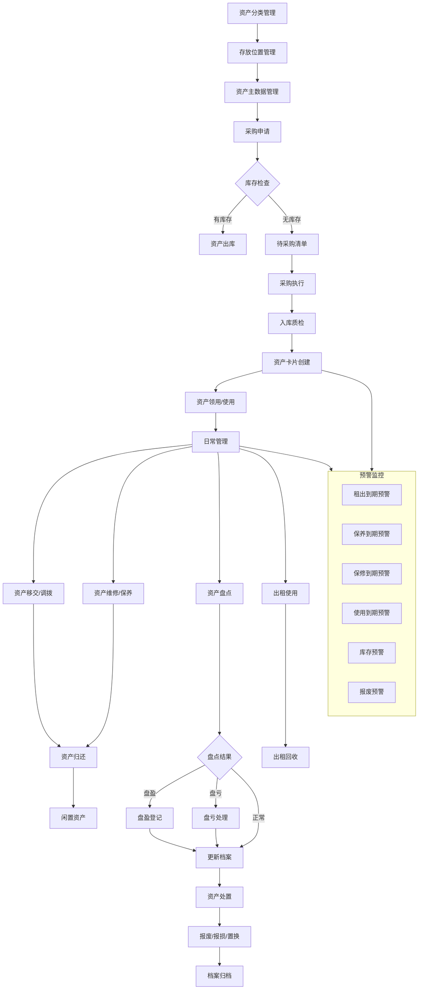

### 1.2 资产取得流程

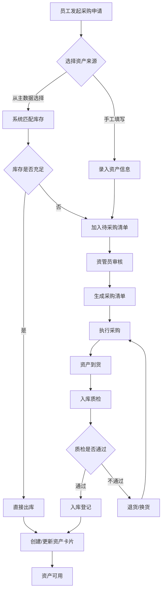

### 1.3 资产管理流程

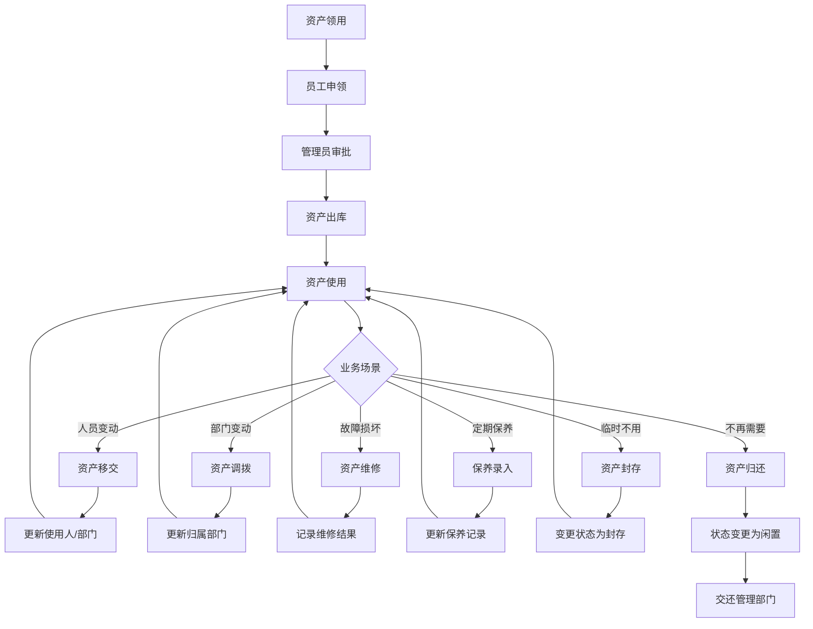

### 1.4 资产处置流程

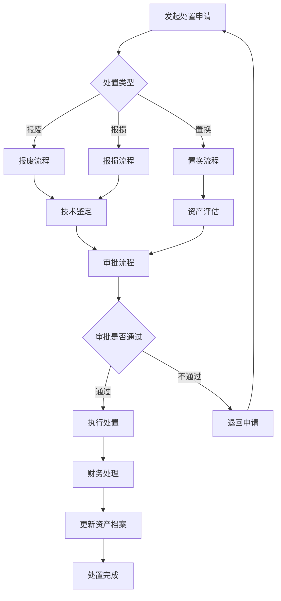

### 1.5 资产盘点流程

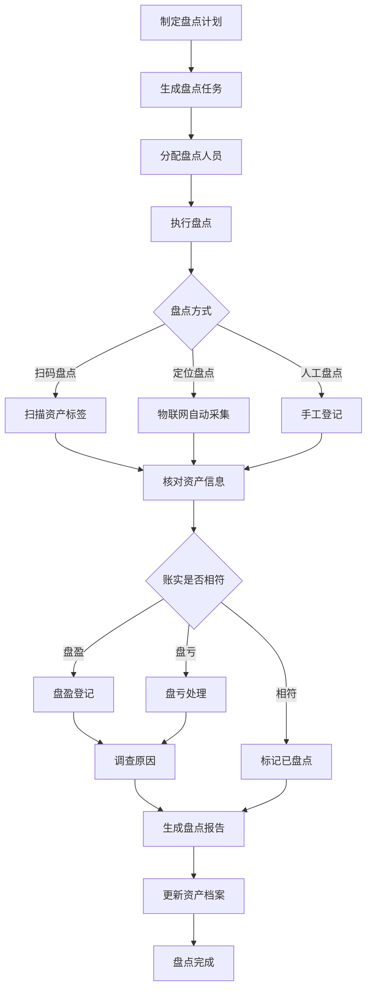

### 1.6 资产定位流程

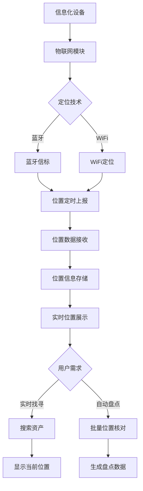

---

## 2. 状态机图

### 2.1 资产卡片状态机

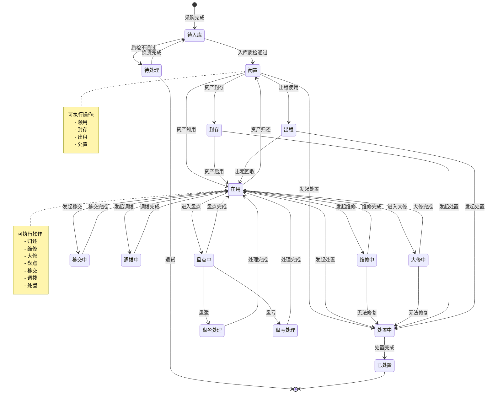

### 2.2 采购清单状态机

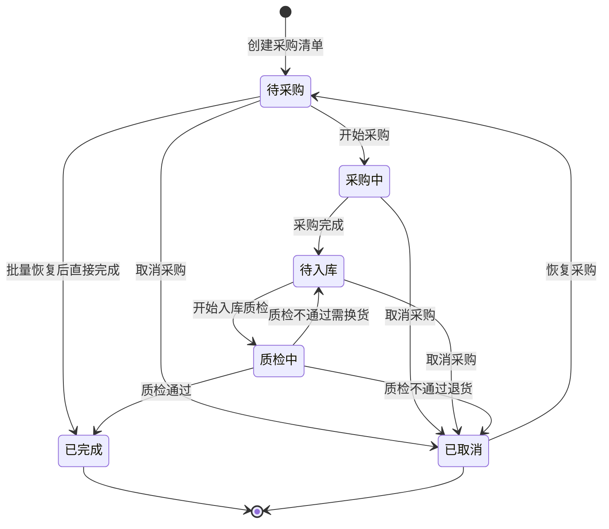

### 2.3 盘点任务状态机

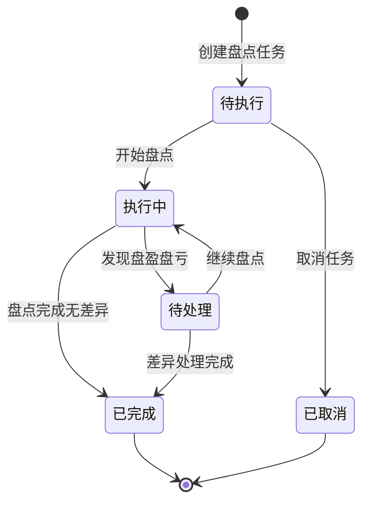

### 2.4 维修单状态机

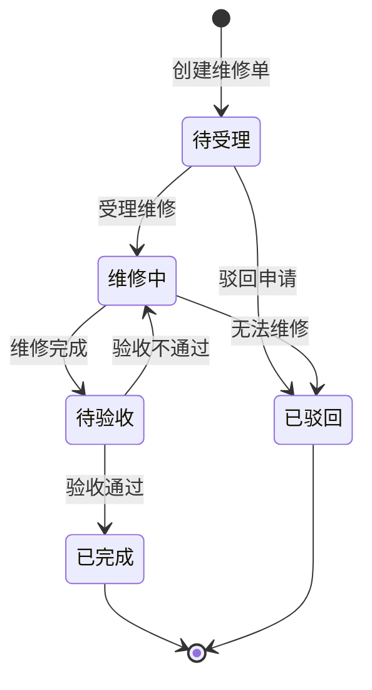

### 2.5 资产处置单状态机

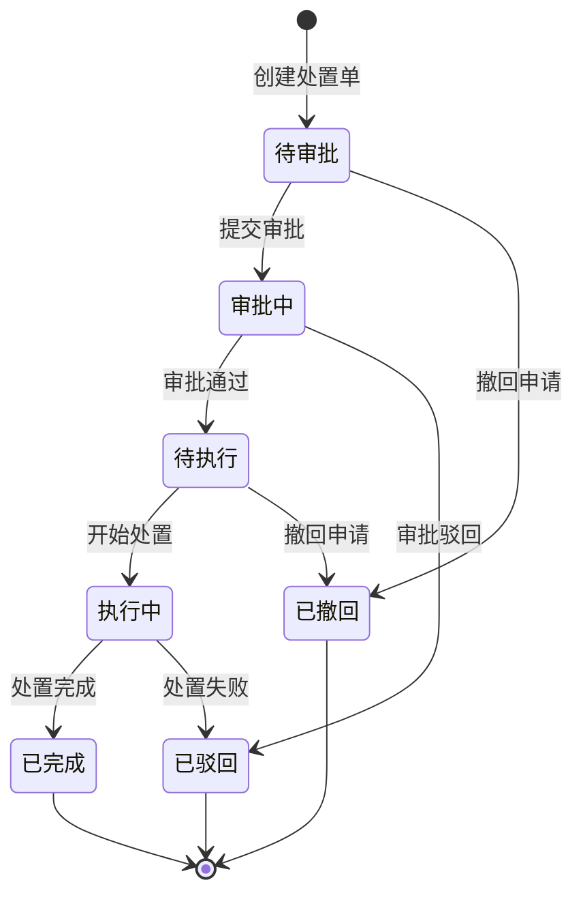

### 2.6 预警状态机

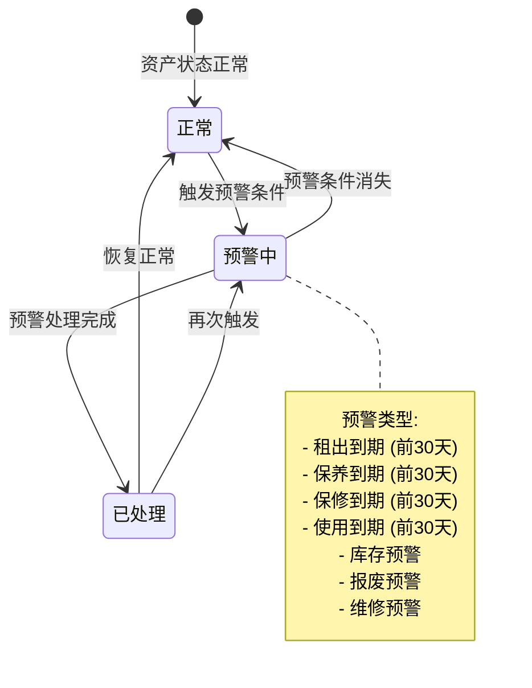

---

## 3. 关键业务流程说明

### 3.1 资产入库流程
1. **采购申请**: 员工发起申请，系统自动匹配库存
2. **采购执行**: 无库存时生成采购清单，执行采购
3. **入库质检**: 资产到货后进行质量检验
4. **卡片创建**: 质检通过后创建资产卡片，进入闲置状态

### 3.2 资产领用流程
1. **申领申请**: 员工提交领用申请
2. **审批流程**: 管理员审核申请
3. **资产出库**: 审批通过后资产出库
4. **状态变更**: 资产状态从"闲置"变为"在用"

### 3.3 资产维修流程
1. **维修申请**: 使用人或管理人发起维修
2. **维修执行**: 记录维修过程和结果
3. **验收确认**: 确认维修完成情况
4. **状态恢复**: 资产重新投入使用

### 3.4 资产盘点流程
1. **任务制定**: 创建盘点任务和计划
2. **现场盘点**: 扫码或物联网自动采集
3. **差异处理**: 处理盘盈盘亏情况
4. **报告生成**: 生成盘点报告并更新档案

### 3.5 资产处置流程
1. **处置申请**: 根据报废/报损/置换类型发起
2. **多级审批**: 按预设流程进行审批
3. **执行处置**: 审批通过后执行处置操作
4. **档案归档**: 更新资产状态为已处置
