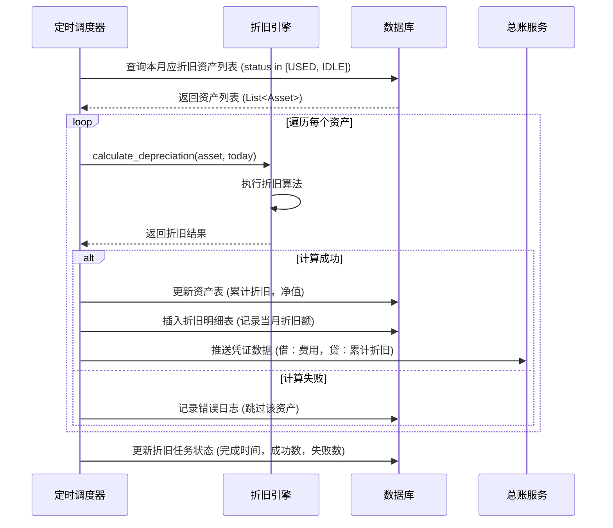
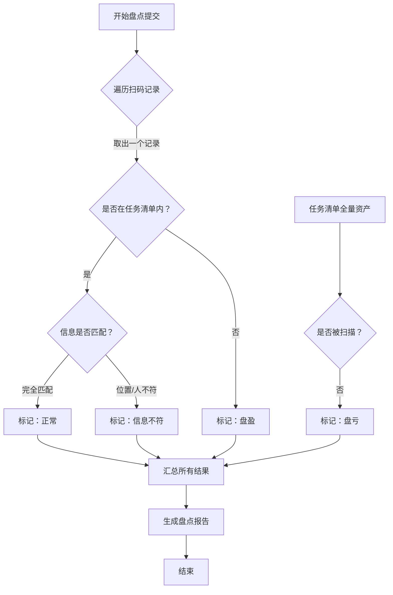
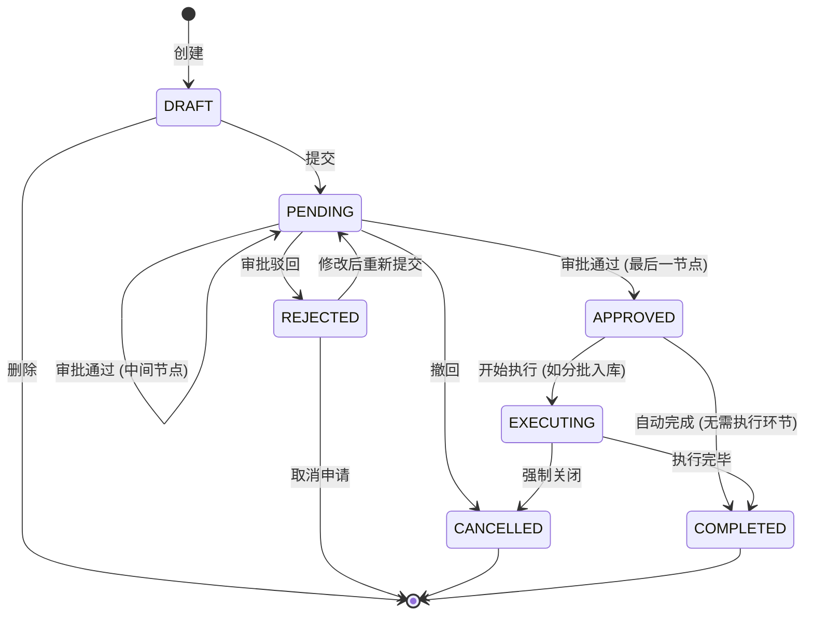

# 复杂逻辑详细设计文档

## 1. 文档概述

### 1.1 目的
本文档针对资产管理系统中的核心算法、复杂计算逻辑、状态流转规则及自动化任务进行详细设计。通过时序图、流程图和伪代码，确保开发人员对业务逻辑理解一致，避免凭感觉编码导致的返工。

### 1.2 适用范围
适用于后端核心业务逻辑开发、前端复杂交互实现及测试用例编写。

### 1.3 涉及模块
- 资产折旧计算引擎
- 盘点差异处理逻辑
- 预警规则引擎
- 审批工作流状态机
- 库存分配算法

---

## 2. 资产折旧计算引擎

### 2.1 业务背景
系统需支持多种折旧方法（平均年限法、双倍余额递减法、年数总和法），每月自动计算资产折旧额，更新资产净值，并生成财务凭证数据。

### 2.2 核心算法逻辑

#### 2.2.1 折旧方法枚举
| 代码 | 名称 | 计算公式 | 适用场景 |
| :--- | :--- | :--- | :--- |
| `SL` | 平均年限法 (Straight-Line) | $月折旧额 = (原值 - 净残值) / 预计使用月数$ | 通用设备、家具 |
| `DDB` | 双倍余额递减法 (Double-Declining) | $年折旧率 = 2 / 预计使用年限 \times 100\%$ <br> $月折旧额 = 期初净值 \times 年折旧率 / 12$ <br> **注意**：最后两年改为平均年限法 | 高科技产品、车辆 |
| `SYD` | 年数总和法 (Sum-of-Years) | $年折旧率 = 尚可使用年限 / 年数总和$ <br> $月折旧额 = (原值 - 净残值) \times 年折旧率 / 12$ | 季节性强的设备 |

#### 2.2.2 计算流程伪代码

```python
def calculate_depreciation(asset, current_date):
    """
    输入: asset (资产对象), current_date (计算日期)
    输出: { month_amount: decimal, accumulated_amount: decimal, net_value: decimal }
    """
    
    # 1. 前置校验
    if asset.status not in ['USED', 'IDLE']:  # 只有使用中/闲置才折旧
        return None
    if asset.purchase_date > current_date:
        return None  # 购入前不折旧
    
    # 2. 计算已使用月数
    months_passed = get_months_between(asset.purchase_date, current_date)
    total_months = asset.useful_life_years * 12
    
    if months_passed >= total_months:
        # 已提足折旧
        return {
            "month_amount": 0,
            "accumulated_amount": asset.original_value - asset.salvage_value,
            "net_value": asset.salvage_value,
            "is_fully_depreciated": True
        }
    
    # 3. 根据折旧方法分发计算
    method = asset.depreciation_method
    
    if method == 'SL':
        # 平均年限法
        monthly_depr = (asset.original_value - asset.salvage_value) / total_months
        
    elif method == 'DDB':
        # 双倍余额递减法
        years_passed = months_passed // 12
        remaining_years = asset.useful_life_years - years_passed
        
        # 最后两年转为平均年限法
        if remaining_years <= 2:
            current_net_value = get_current_net_value(asset, months_passed) # 获取当前净值
            monthly_depr = (current_net_value - asset.salvage_value) / (remaining_years * 12)
        else:
            rate = 2.0 / asset.useful_life_years
            # 获取期初净值
            start_of_month_value = get_net_value_at_start_of_month(asset, current_date)
            monthly_depr = start_of_month_value * rate / 12
            
    elif method == 'SYD':
        # 年数总和法
        sum_of_years = asset.useful_life_years * (asset.useful_life_years + 1) / 2
        years_passed = months_passed // 12
        remaining_years = asset.useful_life_years - years_passed
        depreciable_base = asset.original_value - asset.salvage_value
        yearly_depr = depreciable_base * remaining_years / sum_of_years
        monthly_depr = yearly_depr / 12
    
    else:
        raise Exception(f"Unsupported depreciation method: {method}")
    
    # 4. 边界控制：不能折旧到低于净残值
    current_accumulated = asset.accumulated_depreciation
    max_allowed_accumulated = asset.original_value - asset.salvage_value
    
    if current_accumulated + monthly_depr > max_allowed_accumulated:
        monthly_depr = max_allowed_accumulated - current_accumulated
    
    # 5. 返回结果
    return {
        "month_amount": round(monthly_depr, 2),
        "accumulated_amount": current_accumulated + monthly_depr,
        "net_value": asset.original_value - (current_accumulated + monthly_depr),
        "is_fully_depreciated": False
    }
```

### 2.3 批量计算时序图



### 2.4 特殊场景处理
1.  **月中购入**：
    - 规则：当月购入，当月不计提，下月开始计提。
    - 实现：`if (current_month == purchase_month) return 0;`
2.  **资产处置**：
    - 规则：处置当月仍计提折旧，处置次月停止。
    - 实现：判断 `dispose_date`，若在当前计算月份内，正常计算；若早于当前月份，跳过。
3.  **折旧调整**：
    - 场景：用户手动修改了预计使用年限或净残值。
    - 处理：不追溯调整以前月份，仅以当前净值为基数，按剩余年限重新计算未来每月折旧额（未来适用法）。

---

## 3. 盘点差异处理逻辑

### 3.1 业务背景
盘点过程中会出现“盘盈”（有物无账）、“盘亏”（有账无物）、“信息不符”（位置/保管人不符）三种差异。系统需自动生成差异报告，并引导用户进行后续处理（调账、追责等）。

### 3.2 差异判定流程图



### 3.3 差异处理策略表

| 差异类型 | 定义 | 系统自动动作 | 后续人工操作选项 |
| :--- | :--- | :--- | :--- |
| **正常** | 实物与账面完全一致 | 更新“上次盘点时间”、“盘点人” | 无 |
| **盘盈** | 扫到了不在任务清单里的资产 | 1. 创建临时资产草稿<br>2. 记录盘盈数量 | 1. 确认入库（补建档）<br>2. 忽略（视为误扫） |
| **盘亏** | 清单里的资产没扫到 | 1. 标记资产为“待核实”<br>2. 冻结该资产（禁止领用/处置） | 1. 确认丢失（发起赔偿/处置）<br>2. 修正位置（若找到） |
| **信息不符** | 扫到了，但位置/保管人与系统不一致 | 1. 记录差异详情<br>2. 提示“是否一键更新” | 1. 确认更新（同步系统数据）<br>2. 维持原状（需备注原因） |

### 3.4 盘盈资产入库伪代码

```python
def handle_surplus_asset(scan_record, task_id):
    """
    处理盘盈资产：将实物转为系统正式资产
    """
    # 1. 检查是否已存在该编号的资产（防止重复盘盈）
    existing = db.query("SELECT * FROM assets WHERE asset_code = ?", scan_record.code)
    if existing:
        raise BusinessException("该资产编号已存在，无法作为盘盈入库")
    
    # 2. 构建新资产对象
    new_asset = Asset()
    new_asset.asset_code = scan_record.code
    new_asset.name = scan_record.temp_name or "盘盈资产-" + scan_record.code
    new_asset.category_id = scan_record.suggested_category_id # 扫描时选择的分类
    new_asset.status = 'IDLE' # 默认为闲置
    new_asset.location_id = scan_record.current_location_id
    new_asset.custodian_id = current_user.id
    new_asset.source_type = 'SURPLUS' # 来源：盘盈
    new_asset.purchase_date = today # 默认今天，允许后续修改
    new_asset.original_value = 0.00 # 暂估为 0，财务后续评估入账
    
    # 3. 开启事务
    with db.transaction():
        # 插入资产表
        db.assets.insert(new_asset)
        
        # 插入生命周期日志
        db.logs.insert({
            "asset_id": new_asset.id,
            "action": "CREATE_SURPLUS",
            "content": f"盘点发现盘盈，任务 ID:{task_id}",
            "operator": current_user.id
        })
        
        # 更新盘点任务结果表
        db.stock_results.update_status(scan_record.id, 'PROCESSED')
    
    return new_asset.id
```

---

## 4. 预警规则引擎

### 4.1 业务背景
系统需监控多种风险场景（保修临期、合同到期、资产闲置过久、未按时盘点），并在达到阈值时自动触发通知。

### 4.2 规则配置模型
采用 **规则链 (Rule Chain)** 模式，支持动态配置。

**数据结构设计**：
```json
{
  "ruleId": "RULE_WARRANTY_001",
  "name": "保修期临期预警",
  "enabled": true,
  "triggerType": "DAILY_SCAN", // 每日扫描
  "conditions": [
    {
      "field": "warranty_end_date",
      "operator": "BETWEEN",
      "value": ["${TODAY}", "${TODAY} + 30 DAYS"] // 未来 30 天内
    },
    {
      "field": "status",
      "operator": "IN",
      "value": ["USED", "IDLE"]
    }
  ],
  "actions": [
    {
      "type": "NOTIFY_USER",
      "target": "CUSTODIAN", // 通知保管人
      "channels": ["站内信", "邮件"]
    },
    {
      "type": "CREATE_TASK",
      "taskType": "RENEW_WARRANTY", // 创建续保任务
      "assignee": "ADMIN"
    }
  ]
}
```

### 4.3 引擎执行逻辑

```python
def execute_warning_engine():
    """
    每日凌晨执行全量预警扫描
    """
    rules = db.warning_rules.select(enabled=True)
    
    for rule in rules:
        try:
            # 1. 解析条件构建查询
            query_builder = build_query(rule.conditions)
            
            # 2. 执行查询获取命中资产
            matched_assets = db.assets.query(query_builder)
            
            if not matched_assets:
                continue
            
            # 3. 执行动作
            for action in rule.actions:
                if action.type == 'NOTIFY_USER':
                    users = get_target_users(matched_assets, action.target)
                    send_notification(users, rule.name, matched_assets, action.channels)
                    
                elif action.type == 'CREATE_TASK':
                    create_task(
                        type=action.taskType,
                        title=f"[预警] {rule.name}",
                        asset_ids=[a.id for a in matched_assets],
                        assignee=action.assignee
                    )
            
            # 4. 记录预警日志
            db.warning_logs.insert({
                "rule_id": rule.id,
                "hit_count": len(matched_assets),
                "exec_time": now()
            })
            
        except Exception as e:
            log_error(f"Rule {rule.id} execution failed: {e}")
```

### 4.4 常见预警场景配置
| 场景 | 触发条件 | 通知对象 | 动作 |
| :--- | :--- | :--- | :--- |
| **保修临期** | 保修截止日 ∈ [今天，今天 +30 天] | 保管人、管理员 | 发送提醒，创建“续保评估”任务 |
| **长期闲置** | 状态=闲置 AND 闲置天数 > 90 天 | 部门负责人 | 发送提醒，建议调拨或处置 |
| **未按时盘点** | 距上次盘点时间 > 计划周期 (如 180 天) | 资产管理员 | 标红任务，发送催办通知 |
| **高值资产异动** | 原值 > 10 万 AND 发生位置变更 | 财务总监 | 发送即时告警，需二次确认 |

---

## 5. 审批工作流状态机

### 5.1 状态定义
通用审批单据（采购、领用、处置、维修）的状态流转如下：

| 状态码 | 状态名称 | 含义 | 允许操作 |
| :--- | :--- | :--- | :--- |
| `DRAFT` | 草稿 | 申请人保存未提交 | 编辑、提交、删除 |
| `PENDING` | 待审批 | 已提交，等待领导审批 | 撤回（仅发起人） |
| `APPROVED` | 已通过 | 所有节点审批通过 | 执行后续业务（如入库） |
| `REJECTED` | 已驳回 | 任一节点拒绝 | 编辑后重新提交、取消 |
| `CANCELLED` | 已取消 | 发起人主动撤回或作废 | 无 |
| `EXECUTING` | 执行中 | 部分执行（如分批入库） | 继续执行、关闭 |
| `COMPLETED` | 已完成 | 业务闭环 | 查看、归档 |

### 5.2 状态流转图



### 5.3 并发控制逻辑
为防止多人同时审批同一单据导致状态错乱，采用 **乐观锁 + 状态前置校验**。

```java
// Java 伪代码示例
@Transactional
public void approve(Long orderId, Long userId, String comment) {
    // 1. 查询当前订单
    Order order = orderMapper.selectById(orderId);
    
    // 2. 前置校验：必须是待审批状态
    if (!"PENDING".equals(order.getStatus())) {
        throw new BusinessException("当前单据状态不可审批，可能已被处理");
    }
    
    // 3. 校验当前用户是否有审批权 (防止越权)
    if (!workflowService.hasPermission(order, userId, "APPROVE")) {
        throw new PermissionException("您无权审批此单据");
    }
    
    // 4. 执行更新 (带版本号乐观锁)
    int rows = orderMapper.updateStatus(
        orderId, 
        "APPROVED", // 新状态
        order.getVersion() + 1, // 新版本号
        userId, 
        comment
    );
    
    if (rows == 0) {
        // 更新失败，说明版本号不一致，已被他人修改
        throw new ConcurrentModificationException("审批失败，单据状态已变更，请刷新重试");
    }
    
    // 5. 记录审批日志
    auditLogService.record(orderId, "APPROVE", userId, comment);
    
    // 6. 触发下一步动作 (如通知下一节点或执行入库)
    if (workflowService.isLastNode(order)) {
        businessExecutor.execute(order);
    } else {
        notifyService.notifyNextApprover(order);
    }
}
```

---

## 6. 库存分配算法（领用场景）

### 6.1 业务背景
当员工发起领用申请时，若同一种类资产有多个闲置库存（不同批次、不同仓库、不同成色），系统需按策略自动推荐最优库存。

### 6.2 分配策略优先级
1.  **同部门优先**：优先分配本部门名下的闲置资产（减少调拨成本）。
2.  **先进先出 (FIFO)**：优先分配购入日期较早的资产（避免长期闲置贬值）。
3.  **就近原则**：优先分配存放位置与申请人所在楼层/楼栋最近的资产。
4.  **整包优先**：若领用数量>1，优先找同一位置的库存，避免拆单。

### 6.3 算法实现逻辑

```python
def allocate_assets_for_request(request_item):
    """
    为领用申请项分配具体资产
    输入: request_item { category_id, quantity, applicant_dept_id, applicant_location_id }
    输出: List<Asset> 推荐的资产列表
    """
    required_qty = request_item.quantity
    allocated_list = []
    
    # 1. 查询所有可用库存 (状态=闲置)
    candidates = db.assets.query(
        category_id=request_item.category_id,
        status='IDLE'
    ).all()
    
    # 2. 打分排序
    scored_candidates = []
    for asset in candidates:
        score = 0
        
        # 规则 1: 同部门 (+100 分)
        if asset.dept_id == request_item.applicant_dept_id:
            score += 100
            
        # 规则 2: 先进先出 (每早一天 +1 分，上限 50 分)
        days_old = (today - asset.purchase_date).days
        score += min(days_old, 50)
        
        # 规则 3: 同楼栋 (+30 分), 同楼层 (+20 分)
        if asset.location.building_id == request_item.applicant_location.building_id:
            score += 30
            if asset.location.floor == request_item.applicant_location.floor:
                score += 20
                
        scored_candidates.append((asset, score))
    
    # 3. 按分数降序排序
    scored_candidates.sort(key=lambda x: x[1], reverse=True)
    
    # 4. 截取所需数量
    for asset, score in scored_candidates:
        if len(allocated_list) >= required_qty:
            break
        allocated_list.append(asset)
    
    # 5. 校验数量
    if len(allocated_list) < required_qty:
        # 库存不足，返回部分满足或抛出异常
        return {
            "success": False,
            "message": f"库存不足，仅有 {len(allocated_list)} 件，需求 {required_qty} 件",
            "allocated": allocated_list,
            "shortage": required_qty - len(allocated_list)
        }
    
    return {
        "success": True,
        "allocated": allocated_list
    }
```

### 6.4 锁定机制
- **临时锁定**：用户提交申请单时，系统临时锁定选中的资产（状态变更为 `LOCKED`），有效期 24 小时。
- **释放逻辑**：若审批驳回或超时未审批，自动释放回 `IDLE` 状态。
- **最终占用**：审批通过后，状态正式变更为 `USED`，并关联使用人。

---

## 7. 报表统计聚合逻辑

### 7.1 性能优化策略
针对大数据量报表（如“全集团资产原值统计”），采用 **预计算 + 分层聚合** 策略。

### 7.2 实施方案
1.  **实时数据**：小范围查询（如个人名下资产），直接查主表。
2.  **T+1 聚合**：
    - 建立 `rpt_asset_daily_snapshot` 表，每天凌晨跑批存入当日快照（按部门、分类、状态分组汇总）。
    - 报表查询时直接读快照表，毫秒级响应。
3.  **增量更新**：
    - 当资产发生变更（入库、处置）时，触发 Trigger 或 MQ 消息，实时更新当天的快照数据。

### 7.3 快照表结构
```sql
CREATE TABLE rpt_asset_daily_snapshot (
    stat_date DATE NOT NULL,       -- 统计日期
    dept_id BIGINT NOT NULL,       -- 部门 ID
    category_id BIGINT NOT NULL,   -- 分类 ID
    status VARCHAR(20) NOT NULL,   -- 状态
    asset_count INT DEFAULT 0,     -- 数量
    original_value DECIMAL(18,2),  -- 原值总额
    net_value DECIMAL(18,2),       -- 净值总额
    depreciation_month DECIMAL(18,2), -- 当月折旧
    PRIMARY KEY (stat_date, dept_id, category_id, status)
);
```

### 7.4 查询伪代码
```python
def get_department_stats(dept_id, start_date, end_date):
    # 优先查快照表
    sql = """
        SELECT 
            stat_date, 
            SUM(asset_count) as total_count,
            SUM(original_value) as total_value
        FROM rpt_asset_daily_snapshot
        WHERE dept_id = ? 
          AND stat_date BETWEEN ? AND ?
        GROUP BY stat_date
        ORDER BY stat_date
    """
    return db.query(sql, dept_id, start_date, end_date)
```
