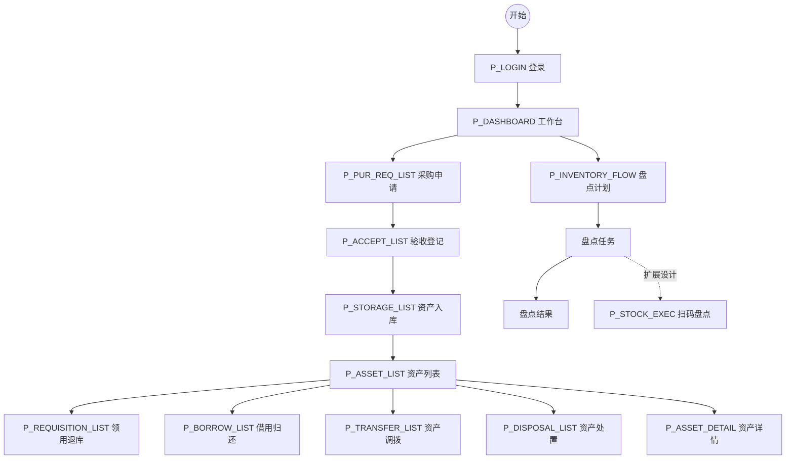

# 界面规格说明书 / 页面功能详细设计

## 1. 文档概述

### 1.1 目的
本文档旨在弥补缺少高保真原型的缺陷，通过文字详细描述系统所有页面的结构、元素、交互逻辑和数据映射关系，作为前端开发和测试验收的唯一依据。

### 1.2 适用范围
适用于 Web 端资产管理系统的界面开发，基于轻量级独立部署架构，优先覆盖管理端（PC）和员工自助端（PC）；移动端 H5 仅要求支持查询、待办查看和少量表单，不以复杂离线能力为本轮前提。

### 1.3 术语定义
- **管理空间**：资产管理员、财务人员、领导使用的完整功能后台。
- **员工空间**：普通员工查看个人资产、发起申请的自助门户。
- **字段联动**：指一个字段的变化引起另一个字段选项或值的变化。

### 1.4 轻量级部署交互基线（2026-06-06）
- 默认运行于单机浏览器访问场景，页面需在普通办公电脑和局域网环境下稳定运行，避免依赖持续联网、长链路轮询或复杂前端本地数据库。
- 主流程表单优先使用真实主数据选择器而不是自由文本，减少单机部署下的手工录入错误；当前采购申请、验收登记、资产入库、资产卡片表单均应遵循该规则。
- 当前 UX 验收重点为桌面端 1280px 以上分辨率；移动端只需保证门户查询和简单提交可用，不要求扫码枪、蓝牙定位、离线缓存等扩展交互。
- 当前系统管理已具备基于角色权限集的菜单可见性控制；无权限菜单不展示，直接访问无权限路由时回退到当前可访问页面。
- 当前工作树显示用户/角色、基础信息、采购/验收/入库、领用/借用/调拨、维修、处置、盘点、报表、资产卡片等页面已完成大范围按钮权限首轮收口；部门数据权限已覆盖资产列表/详情、部门资产、基础报表，以及采购/验收/入库、领用/借用/调拨、盘点结果查询链路；盘点计划/任务则按创建人实施轻量级可见范围控制。
- 当前操作审计已覆盖核心业务单据的后端写操作留痕，并已补齐后端审计查询 API 和独立前端审计查询页。登录/登出、系统管理主数据、资产卡片以及采购/验收/入库、领用/借用/调拨、维修、处置、盘点写操作应在后台自动记录操作痕迹。

### 1.5 当前实现页面基线（2026-06-06）
- 当前已落地的管理端页面以 [`C:\Work\projects\herp\asset-management\frontend\src\router\index.js`](C:\Work\projects\herp\asset-management\frontend\src\router\index.js) 为准，覆盖：登录、工作台、资产列表/表单/详情、采购申请、验收登记、资产入库、附件、变更、维修记录、领用退库、借用归还、调拨、报废申请、处置审批、出售捐赠、盘点计划/任务/结果、我的资产、部门资产、统计/折旧/处置报表、用户/角色管理、分类/位置/部门/供应商/资产主数据。
- 本文档中保留但当前未落地的页面，如独立盘点执行页、预警中心、管理空间/员工空间聚合门户、租出/保养/保修/使用到期专页，统一视为扩展设计，不计入当前版本完成率。

---

## 2. 全局规范

### 2.1 布局框架
- **管理端**：左右布局。左侧为可折叠导航菜单（宽度 200px-240px），顶部为通栏 Header（高度 60px，含用户信息、通知、全屏切换），中间为内容区域（Content），底部为 Footer（版权信息）。
- **员工端**：顶部导航布局。顶部为通栏 Header，下方为卡片式内容流，适配移动端响应式布局。

### 2.2 通用交互规则
| 交互类型 | 规则描述 | 视觉反馈 |
| :--- | :--- | :--- |
| **加载状态** | 列表加载、表单提交时 | 显示骨架屏（Skeleton）或 局部 Loading 转圈；按钮置灰并显示“加载中...” |
| **操作成功** | 增删改查成功 | 顶部显示绿色 Toast 提示“操作成功”，持续 2 秒后自动消失 |
| **操作失败** | 接口报错 | 顶部显示红色 Toast 提示具体错误信息（如“网络异常”、“库存不足”） |
| **确认弹窗** | 删除、提交审批等敏感操作 | 弹出 Modal 对话框，需二次确认“确定要执行此操作吗？” |
| **空状态** | 列表无数据 | 显示缺省插图 + 文字“暂无数据”，并提供“去创建”或“刷新”按钮 |
| **权限控制** | 无权限查看的菜单/按钮 | 当前菜单不显示；按钮按页面实现情况显示为隐藏或保持未收口 |

### 2.3 通用字段规则
- **日期选择**：统一使用日期范围选择器，格式 `YYYY-MM-DD`。
- **金额输入**：保留两位小数，只能输入数字和小数点，千分位展示。
- **必填项**：Label 旁标记红色星号 `*`，未填写提交时红框高亮并提示“该项为必填”。
- **搜索栏**：支持展开/收起，默认展示 3-4 个常用筛选条件。

---

## 3. 页面清单与流转图

### 3.1 页面清单
> 说明：本表优先反映当前代码基线；`扩展设计` 标记的页面仅保留交互预期，不计入当前版本完成率。

| 模块 | 页面名称 | 页面编码 | 适用端 | 描述 |
| :--- | :--- | :--- | :--- | :--- |
| **认证** | 登录页 | `P_LOGIN` | 全端 | 用户名密码登录 |
| | 工作台 | `P_DASHBOARD` | 管理端 | 数据概览、快捷入口 |
| **基础信息** | 分类/位置/部门 | `P_BASIC_TREE` | 管理端 | 树形主数据维护 |
| | 供应商管理 | `P_SUP_LIST` | 管理端 | 供应商 CRUD |
| | 资产主数据 | `P_ASSET_MASTER` | 管理端 | 资产模板与启停维护 |
| **资产档案** | 资产列表 | `P_ASSET_LIST` | 管理端 | 核心查询页面 |
| | 资产表单 | `P_ASSET_EDIT` | 管理端 | 新增/编辑资产 |
| | 资产详情 | `P_ASSET_DETAIL` | 管理端 | 查看基础信息和相关记录 |
| | 附件/变更/维修记录 | `P_ARCHIVE_EXT` | 管理端 | 档案扩展能力 |
| **资产取得** | 采购申请 | `P_PUR_REQ_LIST` | 管理端 | 采购申请列表与表单 |
| | 验收登记 | `P_ACCEPT_LIST` | 管理端 | 到货验收处理 |
| | 资产入库 | `P_STORAGE_LIST` | 管理端 | 入库登记与确认 |
| **日常管理** | 领用退库 | `P_REQUISITION_LIST` | 管理端 | 领用/退库流程 |
| | 借用归还 | `P_BORROW_LIST` | 管理端 | 借用、审批、归还 |
| | 资产调拨 | `P_TRANSFER_LIST` | 管理端 | 调拨列表/表单/详情 |
| | 资产处置 | `P_DISPOSAL_LIST` | 管理端 | 报废、处置审批、出售捐赠 |
| **盘点管理** | 盘点计划/任务/结果 | `P_INVENTORY_FLOW` | 管理端 | 管理端盘点闭环 |
| | 盘点执行页 | `P_STOCK_EXEC` | 扩展设计 | 后续扫码盘点操作 |
| **门户与报表** | 我的资产/部门资产 | `P_PORTAL_BASE` | PC/H5 | 基础门户查询 |
| | 统计/折旧/处置报表 | `P_REPORT_BASE` | 管理端 | 当前已落地报表 |
| | 预警中心 | `P_ALARM_LIST` | 扩展设计 | 临期/异常预警聚合页 |
| **系统管理** | 用户/角色管理 | `P_SYSTEM_RBAC` | 管理端 | 轻量级 RBAC 基础版，当前已扩展到多模块按钮权限首轮收口 |

### 3.2 核心业务流程跳转图

---

## 4. 页面元素逐条描述

### 4.1 登录页 (`P_LOGIN`)
**功能**：用户身份验证进入系统。
**布局**：居中卡片式，背景为系统主题色抽象图。

| 元素名称 | 类型 | 必填 | 默认值 | 校验规则/逻辑 | 数据来源/动作 |
| :--- | :--- | :--- | :--- | :--- | :--- |
| 账号 | Input | 是 | 空 | 当前实现按用户名校验，不能为空 | 提交时调用 `POST /api/auth/login?username=&password=` |
| 密码 | Password | 是 | 空 | 长度至少 6 位 | 同上 |
| 登录按钮 | Button | - | - | 点击触发 Loading，成功后跳首页 | 调用登录接口 |

**交互说明**：
- 输入错误时，Input 框变红，下方显示具体错误（如“账号不存在”）。
- 登录成功后跳转工作台，并在本地保存 Token。
- 当前接口参数通过 query/form 方式提交 `username`、`password`，不是 JSON `account/password/captcha` 契约。
- Refresh Token、找回密码、验证码、记住我属于后续扩展交互，本轮不作为登录页必备元素。

### 4.2 资产列表页 (`P_ASSET_LIST`)
**功能**：查询、浏览、操作资产的核心入口。
**布局**：上部为搜索筛选区，中部为工具栏（按钮组），下部为数据表格。

#### A. 搜索筛选区
| 元素名称 | 类型 | 默认值 | 逻辑说明 |
| :--- | :--- | :--- | :--- |
| 资产名称/编号 | Input | 空 | 模糊搜索，支持回车触发 |
| 资产分类 | TreeSelect | 全部 | 级联选择，选父节点包含子节点 |
| 使用状态 | Select | 全部 | 枚举：闲置、在用、维修、处置中... |
| 所属部门 | DeptSelect | 当前用户部门 | 管理员可见全部，普通员工仅见本部门 |
| 购入日期 | DateRange | 近一年 | 范围选择 |
| 查询按钮 | Button | - | 触发列表刷新 |
| 重置按钮 | Button | - | 清空所有条件回默认 |

#### B. 工具栏
| 按钮名称 | 权限 | 交互逻辑 | 对应接口 |
| :--- | :--- | :--- | :--- |
| 新增资产 | `asset:create` | 跳转资产表单页 | - |
| 批量导入 | `asset:import` | 上传 Excel 弹窗 | `POST /api/assets/import` |
| 批量导出 | `asset:export` | 后台异步生成，完成后通知 | `POST /api/assets/export` |
| 批量领用 | `asset:use` | 选中非闲置资产时置灰 | 跳转领用单 |
| 批量处置 | `asset:dispose` | 选中非闲置/非处置中资产可用 | 跳转处置单 |

#### C. 数据表格列定义
| 列名 | 字段 Key | 宽度 | 排序 | 显示规则 | 操作列内容 |
| :--- | :--- | :--- | :--- | :--- | :--- |
| 资产图片 | `thumbnail` | 80px | 否 | 缩略图，点击放大预览 | - |
| 资产编号 | `assetCode` | 120px | 是 | 固定宽度，超出省略 | - |
| 资产名称 | `assetName` | 200px | 是 | - | - |
| 规格型号 | `specModel` | 150px | 否 | - | - |
| 分类名称 | `categoryName` | 120px | 否 | - | - |
| 使用状态 | `status` | 100px | 是 | 标签展示（不同颜色） | - |
| 使用人/部门 | `userName` | 150px | 否 | 格式化：姓名 (部门) | - |
| 购入日期 | `purchaseDate` | 120px | 是 | YYYY-MM-DD | - |
| 原值 (元) | `originalValue` | 100px | 是 | 右对齐，千分位 | - |
| 操作 | - | 250px | 否 | 固定右侧 | [详情] [编辑] [更多▼] |

**“更多”下拉菜单逻辑**：
- 若状态=闲置：显示 [领用] [调拨]
- 若状态=在用：显示 [归还] [维修] [移交]
- 若状态=正常/闲置/维修：显示 [处置]
- 若状态=处置中：显示 [查看审批]

> 说明：当前代码已稳定支持领用/退库、借用/归还、调拨、维修、处置；“移交”仍属于扩展设计，不应作为当前页面验收前置。

**交互细节**：
- **分页**：底部翻页器，默认每页 20 条，可选 50/100/200。支持“跳至第 x 页”。
- **空状态**：无数据时显示“暂无资产记录”，管理员显示“去入库”，员工显示“请联系管理员”。
- **图片预览**：点击图片弹出 LightBox 全屏查看，支持轮播。

### 4.3 资产详情页 (`P_ASSET_DETAIL`)
**功能**：展示资产全生命周期档案。
**布局**：左侧为资产基础信息卡片（含大图），右侧为 Tab 页签切换不同维度的记录。

#### A. 基础信息区（左侧）
| 字段 | 展示规则 |
| :--- | :--- |
| 资产主图 | 高清大图，支持缩放 |
| 资产二维码 | 动态生成二维码，支持下载打印 |
| 当前状态 | 大号标签展示（如 🟢 闲置） |
| 核心属性 | 名称、编号、分类、规格、原值、净值、购入日期、保修截止日 |
| 当前位置 | 楼栋 - 楼层 - 房间号（带地图图标） |
| 使用人 | 头像 + 姓名 + 部门 |

#### B. 页签内容区（右侧）
1.  **基本信息 Tab**：完整的资产字典字段（制造商、产地、重量、颜色等）。
2.  **变更记录 Tab**（表格）：
    - 列：变更时间、变更类型（领用/归还/调拨...）、变更前值、变更后值、操作人。
    - 数据源：`GET /api/assets/{id}/logs`
3.  **维修记录 Tab**（表格）：
    - 列：报修时间、故障描述、维修商、维修费用、维修状态、附件。
    - 操作：[查看维修单]
4.  **盘点记录 Tab**（表格）：
    - 列：盘点任务名、盘点时间、盘点结果（盘盈/盘亏/正常）、盘点人。
5.  **附件资料 Tab**（网格）：
    - 展示合同扫描件、发票图片、保修卡等，支持预览下载。

**交互说明**：
- 点击右上角 [编辑] 按钮，跳转至 `P_ASSET_EDIT` 页。
- 点击右上角 [打印标签] 按钮，调用浏览器打印组件，生成 A4 标签纸格式。

### 4.4 采购申请单 (`P_PUR_REQ_FORM`)
**功能**：发起资产采购需求。
**布局**：当前实现以列表页内弹窗表单为主，而非独立多步骤页面。

| 字段组 | 字段名 | 类型 | 规则/校验 | 联动逻辑 |
| :--- | :--- | :--- | :--- | :--- |
| **基础信息** | 申请标题 | Input | 选填或按实现映射 | 当前可根据代码字段口径简化处理 |
| | 申请部门 | Input(只读) | 自动获取当前部门 | - |
| | 期望交付日 | DatePicker | 必填，不能早于今天 | - |
| | 预算金额 | InputNumber | 必填，>0，两位小数 | - |
| **采购明细** | 资产分类 | Select | 必填 | - |
| (动态列表) | 资产名称 | AssetMasterSelect | 必填 | 优先从资产主数据选择，允许兼容旧数据手工补录 |
| | 规格型号 | Input | 选填 | - |
| | 参考单价 | InputNumber | >0 | 选择资产主数据后可自动带出默认单价 |
| | 数量 | InputNumber | 必填，整数，>0 | 自动计算小计 = 单价*数量 |
| | 推荐供应商 | SupplierSelect | 选填 | 数据来自供应商主数据 |
| | 操作 | Button | [删除行] | 至少保留一行 |
| | [添加商品] | Button | 在列表末尾追加一行空数据 | - |
| **附件** | 佐证材料 | Upload | 若当前页面未开放则不作为 P0 前置 | - |
| **备注** | 申请理由 | TextArea | 必填，最大 500 字 | - |

**底部操作栏**：
- [保存草稿]：状态存为“草稿”，不触发审批流。
- [提交审批]：校验必填项，状态存为“待审批”，触发工作流。

### 4.5 盘点执行页 (`P_STOCK_EXEC`)
**功能**：执行现场盘点，支持扫码。
**布局**：适合平板/手机操作的大按钮布局。

> 当前状态：本页在 UX 中保留为扩展设计，供后续扫码盘点/移动盘点迭代使用；当前代码基线已实现的是盘点计划、盘点任务、盘点结果的管理端列表闭环，以及从计划执行生成任务。

| 区域 | 元素 | 功能描述 |
| :--- | :--- | :--- |
| **顶部** | 任务信息 | 显示任务名称、应盘数量、已盘数量、进度条 |
| **操作区** | [扫码枪模式] | 激活后，聚焦隐藏输入框，监听物理扫码枪输入（回车符结束） |
| | [摄像头扫码] | 调用 Web 摄像头，识别 QR 码（需浏览器权限） |
| | [手动输入] | 输入资产编号查询 |
| | [拍照上传] | 针对无码资产，拍照上传由后台 OCR 或人工后续处理 |
| **列表区** | 已盘列表 | 实时显示已扫资产： ✅ 绿色：匹配成功 ❌ 红色：不在本任务范围内（盘外） ⚠️ 黄色：重复扫描 |
| **底部** | [暂存] | 保存当前进度到本地，防止断网丢失 |
| | [提交盘点] | 上传所有数据，生成盘盈盘亏报告 |

**交互逻辑**：
- **扫码成功**：播放“滴”声效，列表顶部插入一条绿色记录，计数器 +1。
- **重复扫码**：播放短促“嘟嘟”声，Toast 提示“该资产已盘点”，不计入数量。
- **盘外资产**：播放警示音，弹窗询问“是否将该资产加入本次盘点？”，选“是”则追加任务范围。

---

## 5. 数据来源映射与接口契约

### 5.1 页面与接口映射表
| 页面编码 | 动作/事件 | 触发条件 | 调用接口 (Method URL) | 关键参数 | 返回数据处理 |
| :--- | :--- | :--- | :--- | :--- | :--- |
| `P_LOGIN` | 登录 | 点击登录按钮 | `POST /api/auth/login` | `username`, `password` | 成功：存 Token，跳首页；失败：示错 |
| `P_ASSET_LIST` | 加载列表 | 页面初始化/筛选 | `GET /api/assets/list` | `{pageNum, pageSize, status}` | 渲染表格，计算分页总数 |
| `P_ASSET_LIST` | 删除资产 | 点击删除->确认 | `DELETE /api/assets/{id}` | `id` (路径参数) | 成功：移除该行，Toast 提示 |
| `P_ASSET_DETAIL` | 加载详情 | 页面初始化 | `GET /api/assets/{id}` | `id` | 填充左侧卡片，初始化 Tab 数据 |
| `P_PUR_REQ_FORM` | 提交申请 | 点击提交 | `POST /api/purchase/requests` | `{title, items: [], totalAmount}` | 成功：返回列表，提示“审批中” |
| `P_STOCK_EXEC` | 扫码提交 | 点击提交盘点 | 扩展设计接口 | 扩展设计参数 | 当前版本不作为已实现接口验收 |

### 5.2 字段联动逻辑详解
1.  **省市区联动**（在位置管理中）：
    - 选择“省” -> 触发 `GET /api/dict/area?parentId=省 ID` -> 填充“市”下拉框。
    - 选择“市” -> 触发 `GET /api/dict/area?parentId=市 ID` -> 填充“区”下拉框。
2.  **分类与折旧年限联动**（在资产入库中）：
    - 选择“资产分类” -> 前端读取该分类配置的 `defaultDepreciationYear` -> 自动填充“预计使用年限”输入框（允许手动修改）。
3.  **供应商与联系人联动**（在采购申请中）：
    - 选择“供应商” -> 自动填充“联系人”、“联系电话”、“银行账户”等只读字段。

---

## 6. 特殊状态与边界处理

### 6.1 网络异常
- **场景**：请求超时或断网。
- **表现**：全局拦截器捕获 5xx 或 Network Error。
- **处理**：
    - 列表页：显示“网络连接失败”插图，提供 [重试] 按钮。
    - 表单页：禁止提交，顶部通栏红色警告“当前网络不可用，请检查连接”，本地缓存已填内容。

### 6.2 数据权限边界
- **场景**：用户越权访问（如 A 部门经理强行输入 B 部门资产 ID 访问详情，或在报表接口上传入其他部门 ID）。
- **处理**：当前资产列表/详情、部门资产与基础报表链路由后端按当前用户部门自动收口；越权详情访问返回 403 Forbidden，报表和部门资产查询不会放大到其他部门数据。前端统一拦截 403，不暴露具体数据。

### 6.3 大文件上传
- **场景**：批量导入 10 万条资产或上传 50MB 视频。
- **处理**：
    - 显示独立上传进度条（百分比 + 速度 + 剩余时间）。
    - 采用分片上传（Chunk Upload），支持断点续传。
    - 上传期间禁止关闭页面，若关闭需提示“上传未完成，确定离开？”。

### 6.4 并发冲突
- **场景**：两人同时编辑同一资产。
- **处理**：乐观锁机制。
    - A 打开页面获取 `version=1`。
    - B 修改并提交，`version` 变为 2。
    - A 提交时携带 `version=1`，后端拒绝。
    - 前端弹窗：“该资产已被他人修改，请刷新页面后重试”，并提供 [对比差异] 功能。
